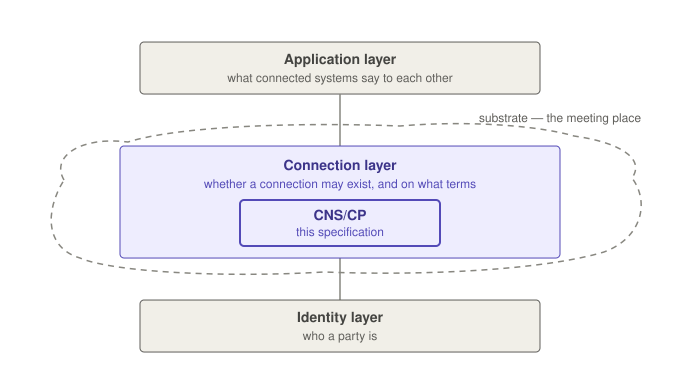

# CNS/CP Specification — 2026 Revision

## Clean reading copy — Sections 1 to 10

> **Draft preview for information only — not a contribution to OSTERA.**

**Editors:** Toby Considine, Anto Budiardjo
**Assembled:** 14 September 2026, from the canon working drafts as of this
date (§1 v0.9, §2 v0.14, §3 v0.16, §4 v0.18, §5 v0.16, §6 v0.21, §7 v0.18,
§8 v0.26, §9 v0.21, §10 v0.18).

**What this is.** The full drafted specification in sequence, with all
editorial apparatus removed — drafting notes, changes tables, provenance
ledgers, open questions, and editors' notes. NOTE paragraphs remain
because they are spec text, marked informative. Figure 1 is supplied
alongside as `cnscp_fig_three_layers.png`; it is informative, and the
text stands without it. The PDF copy of this document carries line
numbers in the margin; review comments should cite them.

**What this is not.** Not a version. The canon working drafts remain the
source of truth, and any comment or edit should be made against them;
this document is regenerated from canon and never edited directly.

**How this revision was written.** The design and every decision in this
document are the editors', made in review with the CNS/CP pre-working
group between July and September 2026. The text was drafted and revised
with Claude, an AI assistant made by Anthropic, working under the
editors' direction from those decisions; every sentence was read by an
editor, and the normative sections by the group, before it stood. A
register kept alongside the drafts records each decision, who made it,
and when. The method is stated here because it was unusual; it does not
bear on the text, which is to be read on its own terms.

**Review state.** Every section has been before the pre-working group,
most of them more than once: §1 and §2 in early August, §3 and §4 on
18–21 August, §5–§7 on 25 August, the whole document on 1 September, and
§6, §8 and §10 again on the calls of 8 September. On **14 September the
group walked the forty substantive points the editors had drafted since
the last full review, one by one, and raised no comment on any of them**.
The body of this document is settled so far as the pre-working group is
concerned.

Three pieces are newer than that review and the group has not yet seen
them: Appendix A, the front matter, and the note in this title page on
how the revision was written.

**Known open points.** Short, and none of it structural:

- §6.5 — Channel quantitative floors, and Realm limits on Channel
  throughput. The editors propose none in this revision; nobody has
  asked for any. The Protocol attribute's anchoring to IANA names
  stands as a SHOULD.
- §7.1 — the allocation-function and continuity sentences, awaiting
  Considine's review; §9.3's companion clauses he has ratified.
- §4.3 — a Context is a string, and may also carry richer structure a
  Realm interprets. Reflected as he asked; his eye still wanted.
- Two questions carried from Considine's own -b material: whether
  Inactive is a Capability status as well as a Connection status, and
  querying Capabilities by status. The editors read both as
  implementation surface rather than specification (§2.2).

Institutional questions the specification deliberately does not answer
— who judges conformance, who operates the Registry, who allocates Top
Level Prefixes — are outside its scope and are not open points in the
text.

**Status:** Working draft. Not a contribution; no text herein is final,
and normative keywords appear only where the canon drafts carry them.

---

## 1. Introduction and Scope of the Problem

### 1.1 The gap

Systems increasingly need to interact across organizational boundaries —
boundaries of ownership, of management, and of regulation. Before any data,
tool invocation, or control action can be exchanged, two parties that have
never been integrated must find one another, establish that what one offers
matches what the other needs, and come to be connected on terms both have
accepted. No current standard defines that step. It is performed by hand,
once per pairing, and the terms it settles are recorded nowhere that can be
inspected, audited, or revoked.

This is the problem of systems of systems: independent systems, separately
owned and separately managed, composed to produce capabilities that none of
them holds alone. It has been examined for decades under names including
Systems of Systems, Digital Twins, Industrie 4.0, Smart Buildings, and the
Internet of Things. Two developments have renewed its urgency. Network
architecture is moving toward mesh topologies — within a single cloud,
across clouds, and across the edge — which multiplies the number of
relationships any one system must establish and makes an ad hoc approach
untenable at scale. And agentic AI systems now initiate cross-boundary
interactions on their own behalf, at machine speed and in volume. Agentic AI
is not a separate problem. It is the manifestation of this one that has
become hardest to ignore. Where an interaction is initiated by such a
system, what follows in this specification is also the means to bound it: an
agent's reach into a system of systems is no wider than what it has
declared, and no path around that declaration is defined.

Three conceptual layers locate the gap: an **identity layer** that
establishes who a party is, an **application layer** that defines what
parties say to one another once connected, and between them the **connection
layer** that this specification addresses. The layers, and the substrate in
which Connections are formed and governed, are described in §3.

Where nothing fills that role, endpoints are exchanged out of band,
compatibility is asserted in documentation or inferred from natural-language
descriptions, and the terms of the Connection live in code and configuration
rather than in any artifact that can be evaluated or withdrawn. Three
consequences follow:

- **Bespoke integrations do not scale.** Each pairing is configured
  individually, so effort grows with the number of pairings rather than with
  the number of systems, and each pairing is fragile against change on
  either side. Individual integrations may be stable and long-lived; in
  aggregate the approach does not carry.
- **Capability is asserted, not evaluated.** A declared Capability is not a
  contract. Where interactions carry operational consequence — actuation,
  payment, control, safety — a description interpreted on a best-effort
  basis is not an adequate basis on which to connect.
- **Authorization does not travel.** When an interaction crosses an
  organizational boundary, the permissions and scope that applied on one
  side have no defined representation on the other. Whatever was settled at
  configuration time drifts as systems, vendors, and tasks change.

What a party owes its counterparts under this specification is limited to
what it declares. Nothing about how that declaration is met —
implementation, vendor, internal architecture, what changes behind it over
time — is any other party's concern, and this specification takes no
position on it. That separation is what lets a declaration hold while
everything behind it changes, and the rest of this specification is built to
preserve it.

This specification defines that missing step: common ground in which parties
declare what they can do, a defined process establishes whether a Connection
is permitted, and Connections come into existence as explicit, inspectable
artifacts rather than as side effects of configuration.

### 1.2 What this specification defines

This specification defines a namespace and naming scheme for Connection
types (§6, §7), the Connection Profile declaration model (§6), a governed
connection process — Enroll, Authorize, Declare, Reconcile, Match, Bind —
through which declared Capabilities become governed Connections (§8), the
matching rules that determine when two declarations are complementary
(§8.6), and the binding definition: what a bound Connection is, and what may
flow across one (§8.7).

On the name: CNS, the Connectivity Naming System, is not one component among
these. It is the system they make up — the namespace, the registration and
resolution machinery, and the six-step process in operation. CP, the
Connection Profile, is the contract that system enacts.

Equally important is what it does not define: a hosted service, a namespace
authority with any operational role (§7.5), an identity system, or an
application protocol. Section 2 states the scope boundary precisely; §5
describes the coordination with the layers this specification does not
replace.

### 1.3 Provider and Consumer roles

The two ends of a Connection are described as **Provider** and **Consumer**.
These identify which party offers a Capability and which uses it, for a
given Connection type only. Roles are defined in §4.5.

### 1.4 Relationship to other layers

What is defined here coordinates with the identity and application layers
and replaces neither. The architecture is given in §3; the coordination
mechanics are in §5.

---

---

## 2. Scope Statement

### 2.1 What this specification covers

This specification defines what must be true for two **Nodes** to be
connected under common governance, and nothing about how any implementation
achieves it. A Node is the entity through which a system participates in a
Realm; a system may hold several Nodes. They are defined in §4.

The formation of a governed Connection proceeds through the six steps
defined in §8: Enroll, Authorize, Declare, Reconcile, Match, and Bind. The
first three constitute **Admission**; the remaining three constitute
**Operation**.

At each step, this specification specifies what is observable between Nodes
— what is declared, what constitutes a match, what a bound Connection is —
and leaves how a Governor reaches those outcomes to the Governor's own
implementation. Nothing in that implementation can change what a Profile
requires: a Connection Profile means the same thing in every Realm, however
the Governor enacting it is built.

The outer edge of normative conformance is defined in §9. Nothing outside
that set is required in order to conform.

### 2.2 What this specification does not cover

The exclusions below follow from a single rule: **this specification states
what must be true, not how it is achieved.** A given Realm may have its own
rules, defined within that Realm by whoever governs it, and this
specification takes no position on them beyond requiring that they be
published to the Realm's Nodes (§8.1).

Accordingly, the following are outside the scope of this specification:

- **Context matching beyond exact match.** This specification matches
  Contexts by exact string equality. A Governor may apply further matching
  under its own published rules. This specification does not define what
  those rules may contain, how they are expressed, or how a Governor arrives
  at a result — only that the result is a match or no match.
- **Context discovery.** How an integrator or an application determines
  which Contexts exist within a Realm, and how Contexts used in one Realm
  correspond to those used in another, is outside this specification.
  Tooling that presents available Contexts for selection is an application
  concern. Some Contexts may not correspond at all, and that is a permitted
  outcome. Nothing here prevents a Governor from offering discovery or
  reporting facilities to a suitably authorized requester.
- **Orchestration and workflow.** The sequence in which Connections are
  used, and to what end, is above this layer.
- **Governor internals.** Matching strategies, storage, indexing,
  scheduling, and any optimization of how Connections are brokered at
  runtime.
- **Realm composition.** The arrangement behind a Realm's presence in
  another Realm as a Node — who operates it, and on what terms — is a matter
  for whoever governs each Realm (§10.3).
- **Monitoring and forensics.** Heartbeats, packet counting, Connection
  routing, and automatic detection of Connection state changes. A Governor
  may do any of these; none is required, and none is defined here.
- **Reporting between the parties.** How a Node learns of its Governor's
  decisions, how a status report reaches a counterpart, and when a Node
  reports a status transition are not defined. §8.4 requires that the ground
  of a rejection or refusal be stated; nothing else about the form or timing
  of any report is.
- **Registry distribution.** How a local Registry instance retrieves,
  caches, or federates Connection Profile content.
- **Serialization.** Examples in this specification are conveyed in JSON for
  clarity. No serialization or message binding is mandated.
- **The meaning of what flows across a Connection.** A Connection Profile
  declares what flows across a Connection formed under it — its Properties
  and its Channels — and nothing else does. What a Property's value means
  belongs to the Profile that declares it; what a Channel's payload means
  belongs to the application protocol the Channel carries (§6.5).
- **Delivery semantics.** For Properties, ordering, durability,
  at-least-once versus exactly-once delivery, and behavior when a party is
  unreachable are inherited from the underlying binding and not defined
  here; what is guaranteed is that a path exists, not the properties of that
  path. A Channel delivers as the mode its Profile declares (§6.5), and
  nothing beyond that mode is promised.

### 2.3 Conformance boundary

Normative conformance is defined in §9. It rests on the matching rules and
on the process by which a Connection is established, and on nothing else. An
implementation that satisfies those requirements conforms, whatever else it
does or does not provide.

The keywords SHALL, SHALL NOT, SHOULD, SHOULD NOT, and MAY are normative
only where they appear in capitals, and carry the meanings given them in the
OSTERA drafting conventions. Text marked *(Informative)*, and every NOTE, is
not normative.

The boundary is drawn to preserve a single invariant: **given the same
governing inputs — declarations, published Realm rules, and the Profile
versions and lifecycle state held — any two conforming implementations form
the same Connections from the same unbound pairs.** A Connection keeps the
version it was formed at (§8.6), so what two Realms already hold may differ
with their histories; what they form next does not. The §8.6 NOTE lists the
inputs in full. Where a Realm applies rules of its own, those rules are
published, so that any divergence is declared rather than emergent.

---

---

## 3. Architecture Overview

*This section is informative. It defines nothing; the terms it uses loosely
are defined in §4, and from §4 onward a capitalized word is a defined term.*

### 3.1 Three layers



*Figure 1 — The three layers and the substrate (informative).*

Three layers frame the work of this specification:

- The **identity layer** establishes who a party is. Examples: the X.509
  family, OAuth.
- The **application layer** defines what parties say to each other once
  connected. Examples: BACnet, FHIR, MCP.
- The **connection layer**, between them, settles whether a connection
  between two systems is permitted, and on what terms.

CNS/CP standardizes at the connection layer. It relies on identity but does
not check credentials itself, and connections carry application traffic that
it does not read or interpret.

Systems have always needed to connect across boundaries of ownership and
management, and the places where they can reach each other already exist: a
network, a cloud tenancy, an operator's hosting platform, the Internet. This
document introduces one word for all of these meeting places taken together:
the substrate. The term is coined here, not borrowed from the industry. The
substrate itself is not something this specification defines or constrains;
its work is at the connection layer within it, so that connections made
anywhere in the substrate can be governed, recorded, and relied on.

Until now that work has been done manually (§1.1). The configuration is
static; the systems are not: equipment is replaced, software is updated, and
AI agents now form relationships at machine speed. Manual configuration does
not keep up.

### 3.2 Realms, governors, and connections

CNS/CP draws a boundary around part of the substrate and applies rules
inside it. The bounded space is called a realm. A hospital's information
environment can be a realm; so can a fleet operator's platform, or one
tenant's portion of a shared facility. Every realm has one governor: the
party, or the software acting for it, that holds the realm's rules and
applies them.

Inside a realm, a connection is not something two systems arrange between
themselves. It is granted, through six steps. The first three are admission,
and the governor admits or rejects at each:

1. **Enroll.** A system joins the realm as a node. The governor checks its
   identity against whatever identity infrastructure it trusts.
2. **Authorize.** The node asserts the contexts it wants to act at — the
   wards, feeders, or vehicles that connections will be about — and the
   governor authorizes or rejects each assertion.
3. **Declare.** The node declares what it can do, in terms of a published
   profile: a named, versioned contract stating what each side supplies.

The governor has admitted a node that passes these three: it is in the
realm, and its declarations stand — waiting, if need be, for a counterpart
that turns up months later. Nothing more is asked of it. Neither system need
know the other exists: each acts on its own account, and it is the
governor's own matching, not an arrangement between them, that joins the two
into a connection.

The governor's discretion lives in these first three steps. It can turn away
an identity it does not trust, and a realm that keeps a strict register of
allowable contexts — nuclear or military practice — can refuse an assertion
at Authorize. At Declare there is less to decide: the governor cannot refuse
a declaration because of which profile it names — unless the realm's
published policy restricts which profiles it binds, in which case it says so
at the door, applies the restriction to every node alike, and gives the
reason when it refuses. Most realms' policy says nothing about profiles, and
then there is no restriction. And in the steps that follow, the realm's
published rules can extend what counts as a match, but never suppress one.

The remaining three are the realm's operation. The governor runs them
continuously, for as long as the realm exists:

4. **Reconcile.** As nodes, contexts, and declarations change, the governor
   creates, re-forms, or dissolves the connections affected.
5. **Match.** The governor finds declarations that fit together: same
   profile, complementary roles, and matching contexts — identical at
   minimum, or related under the realm's own published rules.
6. **Bind.** The governor forms the connection and attaches both nodes to
   it, each with its counterpart, terms, and starting values. Data now
   flows.

The product is a connection: a recorded relationship between two systems, on
stated terms, at a known context. What can be listed, checked, and revoked
is the record, not the data. And when one of its systems is replaced by
another declaring the same capabilities, the governor reconciles and the
connection re-forms — nothing is re-integrated by hand.

Five facts about this arrangement:

- Matching is complete within a realm. Every pair that fits becomes a
  connection; where several counterparts fit, all of them connect. Choosing
  which connections to use belongs to the systems holding them, not to the
  governor.
- Everything that passes through a connection passes through the realm. A
  connection carries what its profile declares, and the realm conveys all of
  it. Two systems exchanging data by any other means have not made a
  connection, and this specification says nothing about what they are doing.
- Full automation is not assumed. A realm may keep people in its decisions
  at admission — whom it enrolls, what it authorizes — and its published
  rules may make a person's approval a condition of any match those rules
  add beyond the exact-context floor. What no realm may do is withhold a
  match the floor requires: matching is complete.
- Given the same declarations, the same published realm rules, and the same
  profile versions held, every conforming governor forms the same
  connections. A connection keeps the version it was formed at, so two
  realms with different histories may hold connections at different versions
  of one profile while forming identical new ones. A realm may add rules of
  its own, but they are published, so any difference is declared rather than
  emergent.
- Governors are replaceable; the realm is the durable object. A realm is
  defined by what it holds — its contexts, declarations, connections, and
  rules — not by the software that governs it. All of that survives a change
  of governor, an operator changing hands being the ordinary case.

### 3.3 Specification overview

§4 defines the terms, after which capitalized words carry these defined
meanings. §5 describes coordination with the identity and application
layers. §6 and §7 specify profile content, naming, registration, and
resolution. §8 defines the six steps. §9 provides conformance rules. §10
covers deployment, including how realms work together.

---

---

## 4. Canonical Vocabulary and Entities

This section defines the terms this specification depends on — words that
are not uniformly understood in the industry, or that carry a specific
meaning here. From here on, a capitalized word carries the meaning defined
here and no other.

Words not defined here are used in their ordinary sense. *Operator* is one:
it means whatever person, organization, or system runs the thing in
question, and no requirement in this specification turns on it. Where a
distinction matters, the specification names a defined term instead — the
party that holds a Realm's rules and applies them is its Governor (§4.1),
whoever the Governor happens to be.

### 4.1 Realms and Governors

A **Realm** bounds the region within which its Governor forms Connections —
a governed region of the substrate described in §3. A hospital's information
environment can be a Realm; so can a fleet operator's platform, or one
tenant's portion of a shared facility.

Within a Realm, interaction is governed: only the Realm's Governor forms
Connections, and everything a Connection carries passes through the Realm
(§8.8). Outside any Realm, systems may still interact; such interaction is
ungoverned, and it is outside the scope of this specification.

A Node (§4.2) takes part in a Realm only once that Realm has admitted it
(§8.2). Matching occurs only among the Capabilities declared within a single
Realm, even where one Governor governs both — the boundary is the Realm, not
the Governor. Realms interoperate by composition, not by matching across the
boundary: a system admitted to both Realms consumes in one and provides in
the other, and each Connection remains within its own Realm — a Node in one
Realm may itself be the Governor of another (§10.3). This specification
defines no relationship between Realms beyond that: **a containing Realm
sees a Node, not the Realm behind it.**

The Realm is the durable object of this specification. It holds a Context
Register and the Connections established within it, and it remains the same
Realm across changes in which Nodes take part in it.

A **Governor** is a role with respect to a Realm. Whatever holds that role
holds the Realm's rules and its Context Register, decides whom it admits,
and performs the operations of §8 — reconciling, matching, and binding. This
specification does not determine whether the role is discharged by an
organization, by a system, or by both, in the same way that it does not
determine what a Provider or a Consumer is (§4.5). Nor does it determine how
the role's work is divided: conveying what a Connection carries (§8.8) may
be done by a component acting under the Governor's authority rather than by
whatever holds the role.

The relationship between the two is fixed in three respects:

- A Realm has exactly one Governor at any given time, and cannot exist
  without one.
- A Governor may govern many Realms, which remain separate from one another.
- The Governor of a Realm may change over the Realm's life. The Realm's
  identity, its Context Register, and its existing Connections are
  unaffected by that change; the new Governor's rules apply from that point
  forward, and Reconcile (§8.5) is what carries the consequences.

A Realm is the governance boundary within which Connections are formed, and
can serve as a security and privacy boundary; what follows from that is
described in §10.2.

### 4.2 Nodes

A system participates in a Realm through a **Node**. A system may hold
several Nodes, within one Realm or across many — and a system present in
more than one Realm is how Realms interoperate (§10.3). The Node is what
moves through the six steps of §8: it enrolls, it asserts Contexts, and it
declares Capabilities. Nothing in this specification requires a Node to
correspond to any physical or deployment boundary of the system holding it.

A Node's obligations to other Nodes are limited to the Capabilities it
declares. Nothing about how a Node meets those obligations — what it runs,
what it stores, what else it talks to — is visible through the Realm, and
nothing here requires it to be.

A Node is identified within a Realm by an identifier its Governor
recognizes. This specification does not determine the form of that
identifier: it may be a URI, a URL, a Decentralized Identifier, or anything
else that makes sense to the Governor. A Governor may assign identifiers
itself, or accept identifiers that Nodes arrive already holding. How a Node
comes to hold an identity, and how that identity is verified, belong to the
identity layer (§5.1).

### 4.3 Contexts and the Context Register

A **Context** denotes an entity within a Realm's scope — a feeder, a ward, a
vehicle, an asset. It is a referent, not a possession: it belongs to no
Node, and no Node's departure removes it.

A Governor keeps a **Context Register**: the record of the Contexts it knows
within its Realm. It is populated from two sources: by assertion (§8.3), and
by the Governor itself — a Governor whose responsibilities reach beyond
connectivity may hold Contexts before any Node has asserted them, as a
hospital's governor may already hold a register of its wards. A Context is
the same Context whichever way it arrived. This specification requires
nothing of the Register's structure: matching consults it solely for the
Contexts it contains (§8.6). A Governor may hold its Contexts in a knowledge
graph or any other richer form, and a Context may itself carry richer
structure; whatever either contributes is the Governor's own affair, above
the exact-match floor (§8.6) and invisible to this specification. The
Register holds the entities this Realm takes to exist and to be available
for Connections.

NOTE — The Context Register is not populated at Enroll (§8.2), which
concerns a Node's identity. It gains Contexts when the Governor authorizes
an assertion (§8.3), or when the Governor enters them itself.
*(Informative.)*

A Node asserts a Context: it declares to the Governor that the entity the
Context denotes exists and is available for Connections. Where the Context
is not already in the Register, the authorized assertion brings it in; where
it is already present — by earlier assertion or by the Governor's own entry
— the assertion is a claim of co-reference, that this Node means the same
entity. An assertion carries nothing further: it obliges no other party, and
nothing beyond the Context itself enters the Realm's matching.

A Governor may evaluate an assertion against what its Register already
holds. A Realm whose Governor knows its entities may refuse an assertion
that names none of them; a Realm may equally admit Contexts its Governor has
never seen, bringing them into the Register on first assertion. Both
conform: whether a Realm's Contexts are open to introduction by Nodes or
validated against what the Governor inherently holds is the Realm's own
decision, and this specification requires neither. Either way the Governor
decides at Authorize, as one ground among its undecomposed reasons (§8.3).

NOTE — A Node need not assert one Context at a time. A system that already
models a Realm's entities — an asset register or a building model, for
instance — may assert every Context it holds in a single pass; each
assertion is evaluated exactly as it would be alone (§8.3). *(Informative.)*

What an assertion does not create is the entity denoted. The ward exists
whether or not any system has mentioned it, and goes on existing when every
system that mentioned it has gone. That is why a Context outlives the Node
that asserted it.

**Every Node asserts a Context in the same way, and nothing follows from
asserting it first.** Where the Governor did not already hold a Context, its
first assertion brings it into the Register and later assertions claim
co-reference with it — but no Node holds rights in a Context by having named
it before another did, and none by the Governor having named it before any
Node.

A Context is asserted at Authorize (§8.3); a Capability is declared at
Declare (§8.4), and only at a Context the Node has already asserted and the
Governor has already authorized.

Authorization is what confers standing: a Node has standing at a Context
once its Governor has authorized the Node's assertion of it (§8.3) — the
assertion alone confers nothing.

A Context is a string. Nothing requires it to be human-readable or to
disclose what it denotes: an opaque identifier is a Context like any other,
and may be entirely meaningful to whoever assigned it.

### 4.4 Connection Profiles, Capabilities, and Connections

A **Connection Profile** names an interaction — the something two systems do
together — and specifies the two complementary roles that enact it, the
Properties each role supplies, and any Channels it declares. It is a
template, not an instance. Connection Profiles are described in §6, and
named, published and resolved as described in §7. This specification also
refers to a Connection Profile as a **Profile**; the short form denotes the
same defined term.

Profiles are registered with, and resolved from, the **Connection Profile
Registry** — referred to throughout as the **Registry**, the short form
denoting the same defined term (§7.3). It is distinct from a Realm's Context
Register (§4.3): the Registry holds Profiles and is one, global, and outside
any Realm; a Context Register holds Contexts and belongs to a single Realm.

A Profile consists of named **Properties**, and may also declare Channels
(below). A Profile assigns each Property to the role that supplies its
value, and marks it required or optional (§6.4).

A Profile also carries a **Header**: the documentary record of its origin
and purpose. Beyond Name, Version, and Status, no Header field participates
in matching (§6.6).

A **Capability** is a Node's declared ability to fill one of those roles: it
names the Connection Profile — at a stated version, or leaving the version
to selection (§8.6) — the role taken, and the Context. The declaration
carries no values. Once it stands, the Node may write a value at the
Capability for each Property with Propagate set; the Capability holds the
latest such value, and it is what a new Connection starts from (§6.4, §8.7).
Declaring a Capability is an undertaking: for as long as the declaration
stands, the Node is able to supply every Property its role requires, and
every Channel the Profile declares, on each Connection the Governor binds
beneath it (§6.4, §6.5, §9.5). Values move across bound Connections, not at
declaration (§8.7, §8.8). The Capability is where a system expresses what it
actually does. Enroll and Authorize concern who a Node is and where it may
act; the Capability is the substance those steps exist to admit.

A **Connection** is the governed relationship established between two Nodes
whose Capabilities have been matched — the interaction the Connection
Profile names, enacted by two Nodes holding its complementary roles. It is
constituted at Bind (§8.7), and it is modeled from the Connection Profile
resolved at that time. A Connection records the Context at which its
Governor matched — which, where the Governor matched under its own rules,
may be a Context that neither Node declared.

A Profile may also declare **Channels**. A Channel is a named service,
declared by the Profile and opened on a Connection, through which the two
roles exchange payloads of an application protocol the Profile names; the
Realm conveys a Channel's payload and neither interprets nor implements the
protocol it carries. Each Channel has one of three delivery modes (§6.5).

What passes through a Connection is what its Profile declares — its
Properties and its Channels — and everything that passes through a
Connection passes through the Realm (§8.8).

Where this specification says *governed Connection* or *bound Connection*,
it means a Connection: every Connection is governed, having been formed
through the process of §8, and every Connection is bound, having been
constituted at Bind. The adjectives emphasize; they do not subdivide.

### 4.5 Provider and Consumer

Every Connection Profile defines two complementary roles, **Provider** and
**Consumer**. A Node holding the Provider role offers what the Profile
describes; a Node holding the Consumer role uses it. The Profile describes
the interaction and holds nothing else: the Capabilities are the Nodes' own.
A Capability declared in the Provider role is a Provider Capability, and one
declared in the Consumer role a Consumer Capability — compounds of the terms
already defined, not terms of their own.

NOTE — These terms are used in preference to *server* and *client* because
the hierarchy those imply does not hold here. In a client/server
architecture, clients look to a few servers, and the clients of a given
server tend to share a purpose. In interactions between independent systems
no such assumption holds: a system may provide the same information to any
number of unrelated systems, provide different information to another set
for a different purpose, and consume from any number of others at the same
time. *(Informative.)*

NOTE — An agent's harness may be constructed entirely as a Node: the agent
interacts with the system of systems only through the Capabilities that Node
declares and the Connections bound to it, and has no other path into a
Realm. This specification takes no position on what constitutes an agent or
a harness; it notes only that Provider and Consumer roles, defined without
reference to what holds them, are sufficient to express this confinement.
*(Informative.)*

The two terms are scoped to a single Connection Profile and say nothing
about what a Node is. A Node may hold Provider Capabilities and Consumer
Capabilities at once, in any number, and may be Provider in one Connection
and Consumer in another. Two Nodes may be peers, each offering a Capability
the other consumes under reciprocal Profiles.

NOTE — This lets a Node bridge two Profiles that do not match each other. A
reader that reports entries and exits states counts, not occupancy; a Node
may consume those counts on one Connection, compute occupancy, and provide
it on a second Connection to whatever needs occupancy. *(Informative.)*

Direction of role is not direction of data. Which Properties flow, and which
way, is determined by the Connection Profile.

### 4.6 Entities and identifiers

The entities above are distinct from the identifiers that name them. A Realm
has a name by which it is addressed, whose form this specification does not
determine. A Node has an identifier its Governor recognizes (§4.2). A
Connection Profile has a name in the namespace of §7.1 and versions created
by publication (§6.2). A Context is a string within a Realm (§4.3). A
Connection has an identifier assigned by the Governor that constituted it
(§8.7).

A Node's identifier is the only one of these that the identity layer bears
on (§5.1). The rest are names within this specification's own scheme and
carry no authentication weight.

An identifier carries no meaning beyond identity. In particular, similarity
between two Connection Profile names implies no relationship between the
Profiles — §7.7 carries the rule.

---

---

## 5. Layer Coordination (Identity and Application)

### 5.1 Coordination with the identity layer

A Realm consumes the identity layer at one defined point: Enroll (§8.2). A
Node presents identity, and the Realm evaluates it against the requirements
its Governor recognizes. The requirements themselves — which infrastructure,
which credential forms, which standard of proof — are the Governor's choice.
This specification neither names nor constrains them. The X.509 and X.500
family, OAuth and OIDC, Decentralized Identifiers, and a Governor's own
assigned identifiers are all admissible, because the process defined here
depends only on the outcome: an identity the Governor recognizes, attached
to a Node.

The coordination continues at the next step. At Authorize (§8.3), when a
Node asserts a Context, a Governor may require evidence of entitlement:
proof, carried by a token or its equivalent, that the Node has standing to
make that assertion. Entitlement is not identity — identity establishes who
the Node is at Enroll; entitlement establishes what it may assert once
admitted. The layer that issues such evidence stands as far outside this
specification as the identity layer does, and the rule is the same at both
steps: the Governor names the evidence its Realm accepts, and the Realm acts
on the outcome of evaluating it, never on the evidence itself.

Each side can change without disturbing the other. A Governor may move its
Realm from one identity infrastructure to another; the Nodes the Realm has
admitted, the Contexts they have asserted, and the Connections bound between
them are expressed entirely in terms this specification defines, and carry
no dependency on the credential forms that admitted them. In the other
direction, nothing defined here feeds back into the identity layer:
admitting a Node asserts nothing about its identity beyond the fact that the
Realm accepted it.

NOTE — Changing identity infrastructure does not itself disturb admitted
standing. Admission is part of the Realm's record: a Node admitted under the
old infrastructure remains admitted, and its Connections continue, until the
Governor acts. What the Governor owes the new infrastructure is
re-establishment of identities under the new infrastructure on the
Governor's own schedule — at once, or over a handover period, as its rules
state. 

### 5.2 Coordination with the application layer

Application protocols — MCP and A2A for agents, BACnet and OPC UA for
operational systems, FHIR for health data, and any other — are what bound
Connections carry. This specification does not join in those protocols,
translate between them, or interpret what they say; it only establishes the
Connection they run over.

The Connection Profile is where the connection layer and the application
layer meet. A Profile names an interaction and declares what a Connection
carries: its Properties, which the Realm conveys between the two roles, and
its Channels, each carrying an application protocol the Profile names (§6).
The Profile's author chooses the Properties and their semantics, and chooses
which protocols the Channels carry, documenting both in the Profile. Both
ends of a Connection therefore interact as the Profile states — that much is
common, and the Profile is where it is written down. What neither end need
know is what stands behind its counterpart: how a Provider comes by the
value a Property carries — from a fieldbus, a database, another Connection
entirely — is the Provider's own affair, and the Profile is the same
whatever stands behind it. Systems whose protocols were never designed to
interoperate can be connected without translation, because both ends declare
against the same named contract.

What the application layer receives from this process is a bound Connection
carrying the Properties and the Channels the Profile declares. Property
delivery semantics are inherited from the underlying binding, and a Channel
delivers as its declared mode provides; neither comes from anything defined
here (§2.2, §6.5). This specification warrants one thing: a governed path
exists between admitted Nodes, on declared terms.

### 5.3 Mutual non-capture

A Connection Profile describes what an interaction looks like: its roles,
its Properties and Channels, its terms. A Connection Profile SHALL NOT
condition its enactment on the identity of any Governor or of any Realm, and
conformance to a Profile SHALL NOT depend on where it is enacted.

NOTE — The Governor is a role (§4.2); the rule therefore reaches whatever
organization or system discharges it. A Profile that requires enactment
under a named party's governance has conditioned its enactment on the
identity of the Governor, and the rule above forbids it. *(Informative.)*

The Governor of a Realm is chosen by whoever operates the Realm, and a
Profile enacts identically under any of them (§3.2). A Profile written once
may therefore be enacted in any Realm.

The same holds in the other direction. A Realm decides which Nodes it
admits, which assertions it authorizes, and what evidence it requires, and
its Governor may refuse a declaration on any such ground: a party, a
Context, standing, or the absence of evidence the Realm's published rules
require of every declaration alike. Which Profile is enacted is not, by
default, a ground: unless the Realm's published rules restrict which
Profiles it binds (below), a Governor SHALL NOT refuse a declaration naming
a published version because of which Connection Profile is named — whether
for all Nodes or for any one of them — and a Realm's matching rules SHALL
NOT suppress a match on that ground in any Realm. The rule applies to
published versions, not to Unpublished Profiles (§6.3).

Absent such a restriction, the ground on which a Governor may refuse a
published Profile is what the Profile requires of the Realm, never which
Profile it is. Where a Profile requires of a Realm something this
specification allows a Realm's published rules to decline, the Governor may
refuse a declaration naming it, provided the rule applies to every Profile
alike. A Realm's rules SHALL NOT otherwise refuse a declaration by Profile
name, by Top Level Prefix, or by the application protocol a Profile names.

A Realm's published rules MAY include a **Profile restriction**: a rule
naming which published Profiles the Realm binds, or which it does not — by
name, by Top Level Prefix, by the protocol a Channel carries, by a list
another party maintains, or in any form the Realm chooses. A Profile
restriction is a clause of the Realm's policy, and this specification places
three conditions on it. It SHALL apply to every Node alike: a Realm
restricts what it binds, never what one Node may declare. Its Governor SHALL
state, before admitting a Node, that the Realm's rules restrict which
Profiles it binds (§8.2), and SHALL publish the restriction with the Realm's
rules (§8.1). And when the Governor refuses a declaration under it, the
Governor SHALL state that ground (§8.4). Matching is unaffected: a
restriction acts at Declare, and a declaration that stands is matched as any
other. A restriction added after declarations stand reaches them through
Reconcile (§8.5).

NOTE — The default is the absence of a restriction, not a setting. A Realm
whose policy has nothing to say about Profiles binds any published one, and
nobody operating it is asked the question. A restriction exists because
someone wrote a policy that names Profiles — an approved list, a certifying
body's list, a class of protocol the site does not carry — and the three
conditions make that policy visible where it acts: at the door, to every
Node alike, and in every refusal. *(Informative.)*

NOTE — The specification provides two grounds of the first kind: a Realm
that does not bind Unpublished Profiles (§6.3), and a Realm whose published
rules state that it does not provide a Channel delivery mode a Profile
declares (§6.5). "This Realm binds no Unpublished Profiles" and "this Realm
carries no best-effort Channels" are rules of that kind. "Only Acme's
Profiles" and "only these protocols" are Profile restrictions — the second
is the first one step removed — and are permitted only as such: declared
before admission, applied to every Node alike, and named in every refusal. A
restriction applied without being declared is a veto, and a Governor
applying one does not conform. *(Informative.)*

NOTE — The no-veto rule does not diminish admission control: what a Realm
legitimately protects, it protects through its parties, its Contexts, and
the evidence it requires uniformly. *(Informative.)*

---

---

## 6. The Connection Profile

### 6.1 The Profile as a machine-evaluable contract

A Connection Profile contains the information by which a Consumer connects
with a Provider: the interaction it names, the two complementary roles that
enact it, the Properties each role supplies, and any Channels it declares.
It is the template from which Connections are made — the metadata required
to establish interoperation, defined once and enacted many times (§4.4).

A Profile specifies; it does not act and it does not hold. The Capabilities
declared against a Profile belong to Nodes (§4.4), the Connections formed
under it belong to Realms (§4.1), and a version of the Profile, once
published, never changes (§6.2). Everything a counterpart may rely on is in
the Profile; everything the Profile does not state is outside the contract.

### 6.2 Profile identity and versions

Every Connection Profile SHALL have a unique name within the single
namespace of §7. Under that name a Profile has one **unpublished** form —
unnumbered and mutable, the form in which the Profile is built — and any
number of **versions** — numbered and immutable, each created by publication
(§6.3). A version is referred to by name and number together:
`cp:example.light:2` names version 2, a different contract from version 1,
and a reference that carries a number denotes content that can never change.
A reference that names no version leaves the version to selection among
published versions (§8.6), and the unpublished form is referred to with the
reserved token `unpublished` in the version's place, meaningful only where a
Realm's rules permit binding against it (§6.3). The reference forms and the
lexical convention are given in §7.

A version's **content** is its Properties, its Channels, and the Header
fields fixed by publication (§6.6); that is what is immutable, and what a
resolved copy holds. Status, Owner, and Website are metadata about the
version, not part of its content, and may change after publication as §6.3
and §6.6 provide.

A version identifier SHALL be an integer, assigned at publication: each
publication SHALL receive the next integer after the highest already
assigned, and the author does not choose it. Version identifiers order
versions and do nothing else; no meaning attaches to their magnitude.

Versions of one Profile are related by the **additive rule**. Measured
against every prior published version of the same name, a new version:

- MAY add a Property, and every Property it adds SHALL be optional;
- SHALL NOT remove a Property, and SHALL NOT redefine one — its name, its
  role, or its Mandatory, Propagate, or Default attribute;
- SHALL NOT add, remove, or redefine a Channel: a Profile's Channels are
  fixed by its first published version;
- MAY change the documentary attributes, Description and Sample, and the
  Header fields that a new version carries afresh (§6.6) — to clarify, and
  not to change what a Property means, what a Channel's protocol requires,
  or which protocol role each Profile role plays. A change of that kind is a
  new contract, whatever attributes it leaves untouched.

Any change these rules forbid is a new contract, and a new contract takes a
new Profile name (§7.7) — registering one is deliberately cheap. It follows
that any two versions of one Profile are compatible in what they require,
and that a Capability declared at a lower version satisfies every
requirement of a higher one.

The rules bind at publication and not before. An unpublished form may be
reshaped without restriction while its author explores it, wandering past
this line and back; the Registry checks it against the prior published
versions only when the author publishes it as the next version (§7.3, §6.3).

NOTE — The additive rule cuts both ways. A Property that proves ill-advised
— a privacy or security liability among the possibilities — can never be
removed from later versions of this name; the remedy is a new name (§7.7).
Channels are stricter still: a later version can neither remove one nor add
one. A Property a Node does not use can be ignored; a Channel cannot — it is
opened at Bind and carries a protocol with expectations of its own, and an
open Channel nobody speaks on is indistinguishable from a broken one.
*(Informative.)*

### 6.3 Lifecycle: Unpublished, Published, Deprecated

Under one name a Profile moves through three states, and movement is
one-way: Unpublished → Published → Deprecated.

**Why a Profile is Unpublished first.** A version, once published, never
changes: the moment a Profile is in use anywhere, altering it would silently
break every counterpart relying on it. But no Profile is right the first
time — it has to be exercised against real Nodes, found wanting, and
reshaped, usually more than once. Something must therefore exist where the
immutability rules do not yet bind, and the unpublished Profile is that
thing. It is held under its registered name, so that testing — alone, or
with the partners its author chooses (§7.3) — happens against the name that
will eventually be published. And because development does not end at
version 1, the unpublished form outlives publication: a problem found in
production sends the author back to the same workspace, to shape the next
version or to discover that a new Profile is needed (§7.7).

The three states:

- **Unpublished.** The state at registration, and the form in which a
  Profile is built. An unpublished Profile is unnumbered, and its author MAY
  add, remove, or redefine its Properties and Channels as often as the work
  requires: it is not a contract. Its content lives with its author, outside
  the Registry, and reaches another party only as the author conveys it
  (§7.3), so nothing elsewhere can have relied on what changed. A version is
  a frozen copy of the unpublished content at the moment of publication; the
  unpublished form persists, still mutable.
- **Published.** The state created by publication — the author's single act
  that freezes the unpublished content as a version, assigns it the next
  integer, and makes it a contract. Publication is the verb this
  specification has always reserved for what an author does with a Profile;
  here is what the act effects. From that moment the version's Properties
  and Channels SHALL NOT change: a version is immutable from publication,
  which is what allows a resolved copy to be cached indefinitely (§7.4) and
  what makes matching deterministic (§3.2). A version SHALL NOT return to
  the Unpublished state — there is no unpublishing: a version can only be
  followed by a later one (§6.2), or Deprecated.
- **Deprecated.** Set by the author when a version should no longer be taken
  up. A Deprecated version remains published in every other respect —
  immutable, resolvable, its Connections unaffected; what changes is
  selection: it is excluded from selection for new Connections (§8.6).

A Governor binds Connections against versions, not against an unpublished
Profile. A Governor SHALL NOT bind a Connection against an Unpublished
Profile unless the Realm's rules provide for it — a Realm is published-only
by default, and binding against an Unpublished Profile is a declared choice,
never a passive one. The choice may be selective by Profile, never by Node:
a Realm that admits some Unpublished Profiles is not obliged to admit all,
but a Realm that binds one binds it for every Node it has admitted. A Realm
can bind only an Unpublished Profile whose content it holds, and it holds
that content because the author conveyed it (§7.3). Where a Realm's rules do
provide for it, Connections bound against an Unpublished Profile are
provisional: its content may change at any time, and Reconcile (§8.5)
carries the consequence. The guarantees this specification builds on
immutability — indefinite caching (§7.4), deterministic matching (§3.2) —
attach to published versions only, and §9 states the corresponding
conformance requirement.

A Governor whose Realm's published rules provide for binding an Unpublished
Profile SHALL publish that Profile's content in full — its Header, every
Property, and every Channel — together with those rules, available to any
party without condition: no identity, credential, membership, or agreement
may be required to obtain it.

NOTE — Binding an Unpublished Profile is a public act, and the rule makes
its content public with it. A Profile that two independent parties are
enacting is no longer one party's private work: what a counterpart can read,
anyone can read, and a circle of Realms cannot hold one another to a
contract nobody outside the circle can see. The rule is self-evidencing —
the rules name the Profile, and the content is either beside them or the
Governor is not conforming. An author who needs to exercise an unpublished
Profile against Nodes in private has the `test` prefix for that (§7.1).
*(Informative.)*

### 6.4 Properties by role

A Connection Profile consists of one or more named Properties (§4.4). For
each Property, the Profile SHALL specify the role — Provider or Consumer —
that supplies its value, and whether supplying it is required or optional. A
Property's name SHALL be unique within its Profile, across both roles and
among the Profile's Channels: Properties and Channels share one name space
within a Profile (§6.5).

The Properties a Profile assigns to the Provider role are what a Node
declaring in that role must be able to supply; likewise for the Consumer
role. A declaration names the role a Node takes; the Node SHALL be able to
supply every required Property of that role for as long as the declaration
stands (§8.4, §9.5). Values are not part of a declaration: they move across
bound Connections (§8.8). A declaration does not state which optional
Properties a Node will supply; that is seen in operation.

A Profile groups its Properties by the role that supplies them, giving the
supplying role structurally rather than repeating it on each Property.
Within its group, each Property carries the attributes **Name**,
**Mandatory**, **Propagate**, **Default**, **Description**, and **Sample**.
Default is optional: where the Profile defines one, it is the value a
Connection starts with for that Property when the supplying Capability has
none at Bind (§8.7); where it does not, the Property has no value until one
is delivered. Description and Sample are documentary: they inform the people
and tools that work with the Profile, and this specification takes no view
of them. Mandatory and Propagate are Booleans, and a Profile SHALL state
each on every Property: neither has a value by absence, and a Profile that
omits one is not well formed (§7.3). This specification defines these
attributes, and a Channel's (§6.5), and no way to add others; a future
revision may.

The Propagate attribute is a Boolean; it selects where a Property may be
written. Every Property may be written at a Connection: the value reaches
that Connection and no other — **addressed** delivery. A Property with
Propagate set may also be written at the Capability: the value reaches every
Connection the Capability holds under that Profile — **broadcast** — and is
the value a new Connection starts with at Bind (§8.7). A Property with
Propagate unset cannot be written at the Capability. In either case the
value is delivered to the counterpart on each Connection it reaches, as a
consequence of the write; a receiving Node sees a Connection, never the
Capability behind it. The Realm supplies each Node with the Connections its
Capabilities hold (§8.7), and the Node selects among them to write. The
delivery rules are given in §8.8.

Propagate is independent of role: all four combinations of supplying role
and flag are valid. An author sets the flag where a value is shared state —
something every counterpart is entitled to observe — and leaves it unset
where a value is meaningful to one counterpart at a time — a reply to the
Connection that asked being the canonical case. Like every part of a
Property's definition, the flag is fixed by publication; changing it alters
the contract and takes a new Profile name (§6.2, §7.7).

NOTE — Propagate selects a write path; it is not confidentiality. A value
that is not broadcast is not thereby hidden, and no flag in a Profile
withholds a value from any party: where confidentiality is required, it
comes from the rules of the Realm (§6.7), not from the Profile.
*(Informative.)*

Direction of role is not direction of data; §4.5 carries the point. Which
Properties flow across a Connection, and which way, is determined by the
Profile alone — in the example of §6.8, required Properties flow in both
directions.

A Profile's Properties equip the two roles with whatever its author chose to
give them, and the Realm conveys every one of them between bound Nodes —
§8.8 carries the rule, §9.2 the conformance form. What the enacting systems
make of the values is application-layer conduct, on which this specification
takes no view; how the values travel is not.

### 6.5 Channels

A Connection Profile MAY declare one or more **Channels** (§4.4). A Channel
is not required: a Profile's Properties carry values across a Connection
without one (§6.4), and a Channel is for what a Property cannot carry — a
protocol's own traffic, a stream. Each Channel carries the attributes
**Name**, **Mode**, **Protocol**, and **Description**. A Channel's Name
SHALL be unique within the Profile among Properties and Channels alike: the
two share one name space, because a Node addresses what a Connection carries
by name. Mode SHALL be one of the three delivery modes below. Protocol
identifies the application protocol the Channel carries: where that protocol
has a registered name — in the IANA Service Name and Transport Protocol Port
Number Registry (RFC 6335) or the IANA TLS ALPN Protocol ID registry — the
author SHOULD use that name; otherwise the Description SHALL state what the
Channel carries. Version qualifiers belong in the Description. Protocol is
for the two Nodes and for the people who read the Profile; the Realm does
not act on it (§5.3). Description is documentary, as for a Property (§6.4).
A Channel is not assigned to a role: both roles may send and receive on it,
as the protocol it carries provides — direction of role is not direction of
data (§4.5). Many protocols have roles of their own, and those are not the
Profile's roles: RTSP has a client and a server, RTP a sender and a
receiver. Where the protocol a Channel carries has roles, the Profile SHALL
say which Profile role plays which protocol role, and SHOULD do so in the
attributes **Provider Role** and **Consumer Role** — each naming the
protocol role that Profile role plays — rather than in the Description
alone, so that what §9.5 asks of a Node is stated structurally.

The delivery modes are three:

- **ordered byte stream** (`stream`) — reliable and ordered, without message
  boundaries;
- **ordered message channel** (`message`) — reliable and ordered, message
  boundaries preserved;
- **best-effort datagram channel** (`datagram`) — message boundaries
  preserved, delivery not guaranteed: messages may be lost, reordered, or
  duplicated.

Reliable here means delivered, not processed exactly once. There is no
unreliable stream: without message boundaries a lost segment leaves the
remainder unparseable, so the combination has no use.

A Channel's payload is the business of the two Nodes. The Realm conveys it
in the declared mode and does nothing else with it: keep-alives, session
state, protocol-level retries, and the meaning of any byte are inside the
Channel. A Realm SHALL NOT retransmit or reorder a best-effort datagram
channel into reliable delivery; a mode delivers as it is declared or the
declaration is worthless.

Each Channel SHALL be flow-controlled end to end, and Channels and
Properties SHALL make independent progress: a Channel whose consumer stops
reading SHALL NOT prevent the delivery of Properties, or the effect of a
withdrawal, on the same Connection. The mechanism is not defined here.

A Profile SHALL NOT declare latency or throughput for a Channel: those are
properties of a deployment, not terms of a contract. An author may state
requirements in the Description, and a Realm whose published rules state
that it does not provide a declared mode may refuse a declaration on that
ground, and otherwise only as §5.3 provides.

The Governor opens every Channel a Profile declares when it binds the
Connection (§8.7): from Bind, each Channel is open to both Nodes. Whether
the Governor establishes the underlying transport at Bind or on first use is
an implementation matter, invisible to the Nodes. A byte stream supports a
half-close, so that an end of transmission is distinguishable from a reset;
whether a Channel survives a break in the underlying connection is not
defined here, and a Node SHOULD NOT assume it does.

A Profile that declares no Channels is unaffected by this section, and every
Profile published before Channels were defined remains valid.

NOTE — A Channel carries an application-level protocol: one that rides on a
transport the Realm can provide in the declared mode. BACnet/SC, Modbus over
TLS, MQTT, WebSockets, and HTTP pass through a Channel as they are. A
protocol that defines its own network stack — BACnet/IP with its broadcast
discovery, Modbus TCP — does not: it terminates at a Node, and the Node
carries what it needs to across the Connection, by Properties or by a
Channel in a protocol that does pass. That Node is the bridge of the §4.5
NOTE, applied to protocols. A protocol that verifies certificates against an
outside authority needs that arranged inside the Realm, as it does on any
network that does not reach out. *(Informative.)*

NOTE — A Profile whose purpose is a Channel still declares at least one
Property (§6.4, §9.4). A Connection is always observable through its
Properties: a Channel alone would give the Governor nothing to see and the
counterpart nothing to read before the Channel carries. A Provider-supplied
state or availability Property is the usual minimum; the second example in
§6.8 shows one. *(Informative.)*

NOTE — The loss of a Channel — the underlying carriage failing, a mode no
longer provided — is a delivery failure, not a change to anything the
Governor holds. Reconcile (§8.5) does not act on it. *(Informative.)*

NOTE — Application-layer protocols travel in a Channel as they are: HTTP
payloads, RTSP control and media, MCP and A2A, OPC UA binary. Protocols that
define their own network layers — BACnet/IP, Modbus/TCP — do not; a gateway
speaking such a protocol on one side and a Profile's Channels or Properties
on the other is a Node like any other, and nothing about the Realm needs to
know the protocol. *(Informative.)*

NOTE — A best-effort datagram channel promises the delivery semantics it
declares and nothing about timing. Real-time media conveyed through a Realm
is deployment-dependent in a way reliable carriage is not, and the author of
such a Profile should say so in its Description. *(Informative.)*

NOTE — A Channel belongs to one Connection, so a Provider with many
counterparts carries one Channel per Connection: a camera with twenty
viewers sends twenty streams. There is no broadcast for Channels as there is
for Properties, and none is intended — a media server that takes one stream
in and serves many is a Node like any other, connected to its source under
one Profile and to its viewers under another. Media that two Nodes exchange
by any path other than a Connection is outside this specification (§8.8).
*(Informative.)*

### 6.6 The Profile Header

Every Connection Profile SHALL include a Header (§4.4) describing its origin
and purpose. The Header is documentary, with three exceptions: Name and
Version identify what a reference names (§7.2), and Status governs whether a
version may be selected for a new Connection (§8.6). **No other Header field
participates in matching**, which is also what allows fields to be added to
it without touching conformance.

All of the following Header fields are REQUIRED:

| Field | Content |
|---|---|
| Name | The Profile's name, which SHALL match the name under which it is registered (§7.3). |
| Version | The version this document describes, assigned at publication. |
| Pub Date | The date of this version's publication. |
| Status | Unpublished, Published, or Deprecated (§6.3). |
| Owner | The party responsible for the Profile. Beneath a Prefix this is whoever its owner has made responsible (§7.1); it need not be the Prefix owner itself. |
| Title | A human-readable title for the Profile. |
| Provider | A title for the Provider role as this Profile uses it. |
| Consumer | A title for the Consumer role as this Profile uses it. |
| Description | What the Profile is for — its use, purpose, and history. |
| Website | The URL of the further specification of this Profile: the document that tells a developer or integrator how to use it. |

After publication, Header fields divide into three classes. **Name, Version,
Pub Date, Title, Provider, Consumer, and Description are fixed by
publication** and SHALL NOT change: they are part of what the version is.
**Status is lifecycle state**, and changes only as §6.3 provides. **Owner
and Website are stewardship fields**: the namespace owner MAY change them
after publication — Owner because a Prefix may change hands, or because
responsibility for the Profile may be reassigned beneath an unchanged Prefix
(§7.1); Website because the document it points to may move. A change to a
stewardship field changes no contract and creates no version; versions are
created only by publication (§6.2).

NOTE — Website is a pointer. What it resolves to is outside this
specification, and a reader relies on the Properties, not the pointer, for
the contract. *(Informative.)*

Additional Header fields MAY be defined (for example, lineage metadata —
§7.7); being Header fields, they are documentary and change nothing about
how the Profile matches.

### 6.7 Deferral to the rules of a Realm

Where the enactment of a Profile meets material this specification does not
define — matching beyond exact Context equality, entitlement requirements,
confidentiality and visibility of values — the Profile defers to the
published rules of the Realm in which it is enacted (§2.2). A Profile SHALL
NOT embed such rules inline, for the same reason it cannot bind a Governor
(§5.3): what a Realm decides belongs to the Realm, and a Profile that
carried its own realm policy would enact differently in different places,
which §5.3 forbids.

### 6.8 Worked example *(informative)*

Two examples follow. The first shows the Header and Properties of
`cp:example.light:1`, a profile connecting a light to whatever controls it;
the second, `cp:example.camera:1`, adds Channels. The `example` prefix is
reserved for documentation and is never registrable (§7.1). JSON is used for
clarity and mandates no serialization (§2.2); Properties are grouped by
supplying role, one array per role (§6.4).

```json
{
  "Header": {
    "Name":     "example.light",
    "Version":  "1",
    "Pub Date": "2026-06-15",
    "Status":   "Published",
    "Owner":    "Example Profiles Organization",
    "Title":    "Simple Light Control",
    "Provider": "Switch",
    "Consumer": "Light",
    "Description": "Connects a controlling device to a controllable light. The Provider supplies the desired state; the Consumer acts on it and reports the state achieved.",
    "Website":  "https://profiles.example.org/light/1"
  },
  "Properties": {
    "Provider": [
      {
        "Name": "state",
        "Mandatory": "yes",
        "Propagate": "yes",
        "Default": "0",
        "Description": "The desired light level as a fraction, 0 to 1; 0 is off, 1 is fully on.",
        "Sample": "0.75"
      },
      {
        "Name": "color",
        "Mandatory": "no",
        "Propagate": "yes",
        "Description": "The desired color of the light.",
        "Sample": "#FFAA00"
      }
    ],
    "Consumer": [
      {
        "Name": "actual",
        "Mandatory": "yes",
        "Propagate": "yes",
        "Description": "The light level actually achieved, as a fraction, 0 to 1.",
        "Sample": "0.75"
      },
      {
        "Name": "power",
        "Mandatory": "no",
        "Propagate": "no",
        "Description": "Present power draw, in watts.",
        "Sample": "8.5"
      }
    ]
  }
}
```

NOTE — The Switch is the Provider because it supplies the interaction's
defining Property, the desired state; the Light consumes that and reports
what it achieved. Which side is Provider is the author's choice, made by
what the interaction is for, not by which device is the more physical
(§4.5). Three of the four Propagate-and-role combinations appear here; the
fourth, a Provider Property with Propagate unset, is equally valid — this
Profile simply has no need of one. Two of the four Properties are supplied
by each role, and the required ones flow in opposite directions: the desired
level travels from Provider to Consumer, and the achieved level travels back
from Consumer to Provider — direction of role is not direction of data
(§6.4). Three Properties are broadcast: a Switch holding many Connections
supplies `state` once and every Light receives it. `power` is addressed
only: a Light supplies its draw to the single Connection that asked, not to
every counterpart it has. `state` carries a Default: a Light bound to a
Switch that holds no current value starts at 0, off, which is the safe
state. `actual` carries none, deliberately — the level achieved has no value
until the Light reports one, and a Default would assert what nobody has
measured (§6.4). A light that cannot render color still conforms as a
Consumer: `color` is optional, and what an enacting system does with an
optional value it cannot honor is application-layer conduct. This Profile
declares no Channels: everything it carries is Properties, conveyed by the
Realm (§6.4, §9.2). *(Informative.)*

The second example connects a camera to a viewer. Channels are not assigned
to a role, so the `Channels` block is a single array; each Channel carries
the attributes of §6.5. The one Property is the minimum §6.5's NOTE
describes: the Viewer can read whether the camera is streaming before, and
while, the Channels carry.

```json
{
  "Header": {
    "Name":     "example.camera",
    "Version":  "1",
    "Pub Date": "2026-09-01",
    "Status":   "Published",
    "Owner":    "Example Profiles Organization",
    "Title":    "Camera Feed",
    "Provider": "Camera",
    "Consumer": "Viewer",
    "Description": "Connects a camera to a viewer. The Provider reports its state and carries its video; the Consumer controls the session and receives the video.",
    "Website":  "https://profiles.example.org/camera/1"
  },
  "Properties": {
    "Provider": [
      {
        "Name": "state",
        "Mandatory": "yes",
        "Propagate": "yes",
        "Default": "idle",
        "Description": "The camera's state: idle, streaming, or fault.",
        "Sample": "streaming"
      }
    ],
    "Consumer": []
  },
  "Channels": [
    {
      "Name": "control",
      "Mode": "stream",
      "Protocol": "rtsp",
      "Provider Role": "server",
      "Consumer Role": "client",
      "Description": "Session control: RTSP over an ordered byte stream."
    },
    {
      "Name": "media",
      "Mode": "datagram",
      "Protocol": "rtp",
      "Provider Role": "sender",
      "Consumer Role": "receiver",
      "Description": "The camera's video. Timing is deployment-dependent (§6.5)."
    }
  ]
}
```

NOTE — `state`, `control`, and `media` share one name space; a third item
called `state` in either block would be invalid. Both Channels open when the
Governor binds the Connection (§8.7), both carry protocol names from the
IANA service-name registry, and each names which Profile role plays which
protocol role, as §6.5 requires. The Consumer supplies no Property, which is
valid: the minimum is one Property in the Profile, not one per role.
Changing either Channel — or adding a third — takes a new Profile name
(§6.2). *(Informative.)*

---

---

## 7. Naming, Registration and Resolution

### 7.1 The namespace and its allocation

There is a single **namespace** containing the set of all Connection Profile
names, held in common and divided by allocation. The first segment of a
Profile name is its **Top Level Prefix**: in `acme.meter.flow`, the Top
Level Prefix is `acme`. An organization is allocated a Top Level Prefix and
thereafter owns every Profile name beneath it — `acme.chiller`,
`acme.meter.flow`, and whatever else it chooses — assigning sub-names as it
sees fit. The model is that of Internet domain names, read in the other
direction: one namespace, divided at the top among its owners, each part
organized as its owner sees fit. This specification follows that model
generally without adopting the DNS's mechanics.

Top Level Prefixes are allocated by a single allocation function. This
specification states that the function exists and is singular; the act of
allocation, the criteria it applies, and the body that performs it are
outside this specification.

A Top Level Prefix allocated before this specification takes effect is an
allocated Top Level Prefix within the meaning of this section.

A Top Level Prefix is cited as `cp:acme`: the reference form with no
sub-name. A one-segment reference therefore always denotes an allocation and
never a Profile — every reference is one or the other. This is the form in
which allocations are recorded and spoken of: an organization holds
`cp:acme`, and registers Profile names beneath it.

The allocation boundary is the Top Level Prefix, and it divides what this
specification governs from what it does not. Allocation of a Top Level
Prefix is the namespace authority's act (§7.5), and each Prefix is allocated
to one party. Everything beneath an allocated Prefix is that party's own
affair: what names it assigns, how it organizes them, which it publishes and
which it leaves unpublished. This specification places no requirement on the
shape or depth of a name below its Prefix.

Two Top Level Prefixes are reserved and SHALL NOT be allocated to any party:
**`example`**, for documentation — every Profile named in this specification
and its training material lives there, and nothing under it resolves — and
**`test`**, for local exercise, never globally resolvable. These follow the
precedent of RFC 2606. The `test` prefix is a place in the namespace; it is
unrelated to the Unpublished state, which every Profile passes through
(§6.3).

### 7.2 Naming convention

A Profile's **name** is its Top Level Prefix and sub-name, joined with dots:
`example.light`. A full **reference** joins the `cp:` marker, the name, and
— where one is intended — a version: `cp:example.light:1` names published
version 1; `cp:example.light`, naming no version, leaves the version to
selection among published versions (§8.6), and is the common form — no party
is required to name a version; `cp:example.light:unpublished` names the
unpublished Profile (§6.3) — a reference the Registry never resolves; only a
Realm holding its content can (§7.4). The token `unpublished` is reserved in
the version position and is not a version identifier — version identifiers
are integers (§6.2) — so the forms can never collide. The marker and the
version are parts of the reference, not of the name.

The `cp:` marker is what makes a reference recognizable — *marker*, because
the form resembles a URI scheme but a reference is not a URI and carries
none of that machinery, and *prefix* is already taken by the Top Level
Prefix (§7.1). A name has no element of its own that identifies it as a
Profile name: `example.light` is well formed, but nothing in its shape
distinguishes it from a domain name, a Context, or a file. Internet domain
names carry that recognition in the suffix, which is always present and
drawn from a controlled set. A Top Level Prefix sits at the front, is
allocated per owner, and carries ownership rather than recognition, so the
marker supplies what the name cannot. Omitting it is correct only where the
surrounding structure already identifies the value as a Profile name, as a
Header field does. The marker's letters come from *Connection Profile*, but
in this specification it serves only as reference syntax: prose writes
*Connection Profile* or *Profile*, never *CP*.

A Profile name SHALL have at least two segments: a Top Level Prefix and at
least one segment beneath it. A Prefix alone is an allocation, not a name
(§7.1), and a Registry SHALL NOT register it as one. The distinction matters
because a Prefix is held and a name is registered: if a Prefix could also be
a name, allocation and registration would collide, and the allocation
boundary of §7.1 would not be a boundary.

Profile names SHALL be lowercase, and SHALL consist only of the characters
`a`–`z`, `0`–`9`, `.` (the segment separator), and `-`. Nothing beyond ASCII
appears in a name. Name comparison everywhere in this specification —
matching (§8.6), registration (§7.3), resolution (§7.4) — is exact string
comparison, and the lowercase rule is what keeps exact comparison and the
DNS-style ownership model consistent with one another: case never varies, so
case-insensitivity is never needed.

By convention, uppercase `CP:` forms — `CP:API` — are documentary and
workstream identifiers, naming families of work rather than resolvable
Profiles; lowercase `cp:` references are the operational form. Only the
operational form appears in declarations and Connections.

### 7.3 Registration

Every Connection Profile SHALL be registered with the Connection Profile
Registry — the **Registry** (§4.4). There is one Registry, as there is one
namespace: a name means the same Profile wherever it is resolved, and that
is what makes a Profile reference portable between Realms. The Registry is
universal in intent and distributed in form: it is accessed through a local
instance, and how an instance retrieves, caches, or federates content is out
of scope (§2.2).

Registration is where a Profile's lifecycle begins: it claims the name
(§6.3), and nothing else. A name is registered under its Top Level Prefix,
and a Registry SHALL NOT accept any act on a name — registration,
publication, Deprecation, a change to a stewardship field, or release —
without the authorization of the name's Prefix owner. How an owner governs
those acts beneath its Prefix is its own affair (§7.1); what the Registry
requires is that the authorization exists. The Header's Name field carries
the registered name, exactly (§6.6).

The Registry holds and answers for published versions only. Of an
unpublished name it holds the entry alone — the name and its registration
date — and it SHALL NOT hold, serve, or answer for the content of an
unpublished Profile. That content is the author's own: it lives wherever the
author keeps it, and reaches a testing partner only as the author conveys
it. How an unpublished Profile's content is conveyed to a partner, and in
what form, is outside this specification. A Realm that takes an unpublished
Profile in does so by its own published rules, and publishes what it has
taken in (§6.3).

A Registry SHALL answer that a name is registered, and since when: the
existence of a claim is public even while its content is not, so a name long
registered but never published can be seen for what it is. A registration
date confers nothing: whatever significance a date carries attaches to
publication, and a name held unpublished for years earns no precedence by
its age.

Publication is the act by which a Profile's content enters the Registry,
when and as often as the author chooses. The Registry checks what it is
given before it publishes: that the Header is complete, that the Properties
and any Channels are well formed and at least one Property is present, and
that the content satisfies the conditions of §6.2 against any prior version.
What passes, the Registry freezes, numbers, and serves; what fails it does
not publish, and it retains nothing of it.

A published version SHALL NOT be deleted, and a name with published versions
is permanent. Capabilities may be declared against a published version in
any number of private Realms, so there is no way to determine that it is
nowhere in use; a Registry that cannot know a name is dead must keep it. An
author retires a version by Deprecating it (§6.3), never by deleting it. A
name with no published versions MAY be released by its owner.

### 7.4 Resolution

A Connection Profile's content is retrieved — **resolved** — from the
Registry when it is needed: at Declare, to validate a declaration against
the Profile (§8.4), and at Match and Bind, where the Connection is modeled
from the Profile's content (§8.6, §8.7).

Resolution returns published versions, and nothing else: a version is
published only if the Registry holds it, and content obtained by any other
means is unpublished content, whatever it calls itself (§6.3). A reference
to an unpublished Profile (§7.2) is resolved not from the Registry but from
the content a Realm holds by the author's conveyance, and only a Realm whose
rules provide for binding it acts on it (§6.3).

Because a published version's content is immutable (§6.2), a resolved copy
of it is indefinitely valid: cached content can never be stale in any way
that affects a match, and only versions not yet held locally ever need
fetching. A version's Status can change after the copy was taken — an author
may Deprecate it — and a Governor working from copies it holds acts on the
lifecycle state it holds, learning of a Deprecation when updated lifecycle
metadata reaches it — from a Registry that has it, or by whatever means its
Realm arranges. No such reasoning is available for unpublished content,
which its author may re-issue at any time; a Realm testing an unpublished
Profile relies on the content it took in, which is what makes those
Connections provisional (§6.2). This is what makes the distributed Registry
sound, and what lets a Realm operate from a local instance without reference
to anything beyond it.

A conforming Governor SHALL be able to operate from a local Registry
instance. A Governor that cannot resolve cannot match, so a Realm whose
resolution depends on reaching a remote instance is a Realm that stops
governing when the network does — and, with a single Registry (§7.3), one
that depends on the continued good behavior of a single institution. The
requirement is what makes a Realm durable in its own right: what it has
bound keeps running, what it has resolved stays resolvable, and it may go on
forming Connections from the versions it holds. §9 states the conformance
form.

NOTE — Immutability is what makes this affordable. Because a published
version never changes (§6.2), a local instance that has resolved what its
Realm uses is not a cache that may fall behind — it is a complete and
correct holding of everything already in use. What a disconnected Realm
loses is reach to versions it has not yet seen, not fidelity in what it has.
*(Informative.)*

### 7.5 The namespace authority is administrative only

The owner of a Top Level Prefix defines Profiles beneath it, registers their
names, publishes their versions, and sets Deprecation. It does nothing else:
it takes no part in any declaration, match, or Connection formed under the
Profiles it publishes, and nothing in this specification places it in any
operational path — in the way that the IETF authors RFCs without sitting in
every handshake that implements them.

Publication is therefore the namespace authority's last shaping act with
respect to a version. From that point the version is a published, immutable
artifact; the Registry serves it, Realms resolve it, and the author is a
bystander to every use — Deprecation being the one word it may still say
about it.

### 7.6 Versioning in the namespace

Versions of a Profile share its name and accumulate under it (§6.2). A new
version is a new contract offered alongside the old, not a replacement of
it: declarations against existing versions stand, Connections bound under
them continue, and nothing about publishing version *n+1* disturbs any use
of version *n*. Which version a Connection forms at, where declarations span
several, is a selection question answered at §8.6 — once, when the
Connection forms.

### 7.7 Breaking changes take a new name

A change that would alter what either role must supply is a new contract,
and SHALL be published as a new Profile with its own name — never as a
version (§6.2).

This specification defines no relationship between Profiles, and
relationships SHALL NOT be inferred from their names: `acme.chiller2` is not
a successor to `acme.chiller`, or related to it at all, by anything this
specification provides. Names identify; they do not describe. Where an
author wishes to record lineage, the Header is the place — an optional field
such as `Supersedes`, carrying a full Profile reference, is documentary like
every Header field (§6.6) and participates in nothing.

Migration needs no machinery beyond what exists: publish the new Profile,
deprecate the old version; existing Connections continue, new ones form
against the new contract, and Nodes re-declare as they are updated. There is
no automatic migration, by design. Publication makes a name permanent
(§7.3), so an author has every incentive to finish a Profile before
publishing under its name — and over lifespans measured in decades, that
incentive is a feature (§6.2).

---

---

## 8. The Governed Connection Process

### 8.1 The six steps

A Connection is formed through six steps in two phases.

In **Admission** a Node submits and the Realm decides, three times: the Node
enrolls with an identity (§8.2), asserts a Context (§8.3), and declares a
Capability (§8.4). These are three decisions, not necessarily three
messages: a Node may submit all three at once, and a Governor may decide
them in one act.

In **Operation** the Realm acts on what it already holds. It reconciles
declarations against current rules (§8.5), matches complementary
declarations (§8.6), and binds them into Connections (§8.7). No Node submits
anything in this phase, and it does not end: a Realm operates for as long as
it exists.

Each of the three Admission steps may require evidence. The Governor names
what its Realm accepts, the infrastructure that issues it stands outside
this specification, and the Realm acts on the outcome of evaluating that
evidence and never on the evidence itself. The evidence is of identity at
Enroll, of entitlement at Authorize, and at Declare whatever a Realm's
published rules require of every declaration alike. Nothing about the form
of any of it, its issuer, its lifetime, or its validation is defined here.
The Operation steps have no equivalent: nobody is submitting.

A Realm's rules are published to its Nodes. A Governor SHALL make its
Realm's rules available to every Node it admits, and SHALL publish a change
to those rules in the same way. What a Governor publishes is what an
admitted Node needs in order to know, before it declares, what its
declaration will be matched against and on what conditions: which Contexts
the Realm treats as matching beyond exact equality, and on what basis; what
it refuses on the grounds §5.3 allows; whether it binds Unpublished Profiles
(§6.3); and whether a person's approval conditions any match its rules add.
How the Governor arrives at any of these is not published, and the form of
the publication is the Realm's own.

NOTE — Publication is to the Realm's Nodes, not to the world. Its purpose is
that nothing a Realm does to a declaration is undeclared, and the Nodes the
Realm holds are who check that. §6.3's duty to publish an Unpublished
Profile's content to anyone is the one exception, since there the
publication stands in for the Registry. *(Informative.)*

### 8.2 Enroll

A Node presents an identity, and the Realm evaluates it against the identity
requirements its Governor recognizes (§5.1). The Governor admits or rejects
the Node on the result. Where the Realm's published rules restrict which
Profiles it binds (§5.3), the Governor SHALL say so before admitting the
Node.

Enroll is the one step where a Realm always requires something: the
Governor's freedom is over what it accepts, never over whether to accept
anything. An admitted Node remains admitted until it leaves or its Governor
acts, including through a change in the identity infrastructure the Realm
relies on (§5.1, §10.4).

### 8.3 Authorize

A Node asserts a Context, and the Governor authorizes or rejects that
assertion. This is one decision, not two: whether the Context is admissible
to the Realm at all, and whether this Node may assert it, are both grounds
on which the Governor decides, and this specification does not decompose its
reasons — among them what its Context Register already holds (§4.3). What an
assertion is, and what it does to the Register, is §4.3's account; the step
adds nothing to it. Assertion is per-Context: a Node enrolls once, may
assert any number of Contexts, and each assertion is decided on its own. An
authorization stands until the Node withdraws its assertion or the Governor
revokes it, which it MAY do at any time. A Governor MAY grant an
authorization for a stated term; when the term ends the authorization
lapses, with the same effect as revocation (§10.4).

A Governor may require evidence of entitlement to a Context, on the terms of
§8.1.

A Node SHALL hold an authorized Context assertion before declaring a
Capability at that Context.

### 8.4 Declare

A Node declares a Capability: a Connection Profile, a role within it, and a
Context whose assertion the Governor has authorized. A declaration names
exactly one Context; there is no blank or wildcard Context. A Node that
offers the same Capability in several Contexts declares it once in each.
Whether a declaration in one Context can match a declaration in another is
decided by the Realm's published matching rules (§8.6), not by anything a
declaration says. At Declare the Governor evaluates what can be evaluated
without a version: that the name is registered, the reference well formed,
and the Context authorized for this Node. Where the declaration pins a
version, the Governor also checks that the version defines the role named,
resolving the content per §7.4; where it names a bare Profile name, that
check completes at Match (§8.6), once the version is selected. A declaration
carries no Property values (§6.4).

A declaration names a Profile in one of the three reference forms of §7.2. A
bare name leaves the version to selection at §8.6, which is the ordinary
case; a pinned version fixes the contract; the `unpublished` token is
meaningful only in a Realm whose published rules provide for binding against
Unpublished Profiles and which holds the Profile's content by the author's
conveyance (§6.3, §7.3).

A declaration that fails this evaluation is defective, and the Governor
rejects it: it does not stand, and nothing follows from it. The defects are
those the evaluation finds — a Profile name that is not registered; a
version that does not exist, or does not define the role named; a Context
this Node is not authorized to assert; the `unpublished` token in a Realm
whose rules do not provide for it.

Refusal is different: the declaration has no defect, but the Realm declines
it under its own published rules. §5.3 limits the grounds to what a Realm
may legitimately require — evidence its rules ask of every declaration
alike; something the Profile requires of the Realm that the Realm's rules
decline, such as binding an Unpublished Profile or providing a Channel mode
it does not carry; or, where the Realm's rules restrict which Profiles it
binds, a Profile outside that restriction. Absent such a restriction, a
Governor SHALL NOT refuse a declaration naming a published version because
of which Connection Profile is named; and in every Realm it may refuse one
only on the grounds §5.3 states — this step adds no ground of its own.

The Governor SHALL tell the Node the ground on which it rejected or refused
a declaration: for a rejection, the defect found; for a refusal, which of
§5.3's grounds applies — evidence not presented, an Unpublished Profile the
Realm does not bind, a Channel mode the Realm does not carry, or a Profile
outside the Realm's restriction. The Governor MAY add text. How the
statement reaches the Node, and its form, are the Realm's own (§8.1).

NOTE — A ground that is knowable at an earlier step is stated there. A Realm
that restricts which Profiles it binds says so at Enroll (§8.2), so a Node
need not declare to find out; a Node that declares anyway is refused with
the ground named. *(Informative.)*

A declaration stands until the Node withdraws it, or what it rests on falls
(§10.4). A Node whose counterpart has not arrived has not failed: its
declaration waits, and Reconcile will act on it when something changes.

### 8.5 Reconcile

Reconcile is the standing obligation to keep the Connections that exist
consistent with everything the Governor holds: admitted Nodes, authorized
assertions, declarations, entitlements, published Profile versions, and its
Realm's rules.

When any of these changes — a Node leaves or its Governor removes it, a Node
withdraws an assertion or its Governor revokes the authorization, a Node
withdraws a declaration, an authorization lapses or an entitlement expires,
the Realm's rules change — the Governor creates the Connections that now
match, re-forms those whose terms have changed, and dissolves those whose
basis has gone. Following such a change the Governor SHALL bring its Realm's
Connections into consistency with what it holds. This specification imposes
no time bound; it requires that consistency is reached.

Reconcile is continuous where the other steps are momentary, which is why
nothing else in this specification needs to speak of timing — and why
time-limited entitlement works at all: without Reconcile, a Connection would
outlive the entitlement that justified it.

Connections bound against an Unpublished Profile, where a Realm's rules
provide for them, are provisional. The Governor identifies the content it
holds for the Profile — by a revision it assigns, or a digest of the content
— and a Connection bound against it records that identifier in place of a
version (§8.7). When the author conveys new content, the Governor takes it
in under a new identifier; that is a change to the Profile, and Reconcile
dissolves the Connections bound against the old content and forms afresh
those that match under the new (§6.3).

### 8.6 Match and select

Two declarations match when all of the following hold:

- they name the same Connection Profile;
- their roles are complementary, one Provider and one Consumer;
- their Contexts match;
- a version can be selected as this section provides, and each declaration
  satisfies the requirements of its role in that version.

Contexts match when their strings are equal. A Realm may treat other pairs
of Contexts as matching, under rules it has published — a Context naming a
floor may be made to match one naming a room within it, for instance. Such
rules extend what counts as a match. A Realm's rules SHALL NOT prevent a
match that would otherwise hold.

Matching is complete. Every pair of declarations that matches becomes a
Connection; where several counterparts match, a Connection forms with each
of them. A Governor SHALL NOT choose among matching pairs. Which of its
Connections an application uses, and in what order of preference, is the
application's own affair and not visible to this specification.

The Governor selects one thing rather than matching it: the version. A
declaration supports a version when it satisfies the requirements of its
role in that version's content, Properties and Channels alike (§6.4, §6.5).
Where both declarations name a bare Profile name, the Connection forms at
the highest published version that is not Deprecated and that both support.
Where one pins a version, the Connection forms at that version if the other
supports it. Where both pin, and pin differently, they do not match. No new
Connection forms at a Deprecated version, whichever reference form names it
(§6.3): a declaration pinning a Deprecated version waits until its Node
redeclares. One Connection forms for each matched pair, at one version. The
Governor selects a version once, when it forms the Connection, and the
Connection stays at that version for as long as it stands: a later
publication affects the Connections formed after it, never those already
bound (§7.6). A Node that wants a Connection at a later version withdraws
its declaration and declares again.

Two declarations that name the `unpublished` token match each other and
nothing else: an unpublished Profile has no version to select, and a bare or
pinned reference never matches it.

NOTE — Determinism follows from these rules together. Given the same
governing inputs — the admitted Nodes, the authorized assertions, the
declarations, the Profile versions it holds and the lifecycle state it holds
for them, its Context Register, its published rules, and the outcome of any
approval those rules require — every conforming Governor forms the same
Connections from the same unbound pairs: the same in their constituents
(Profile, version, Nodes, Contexts, terms), whatever identifiers a Governor
assigns them, because the set is complete rather than chosen. Connections
already bound keep the version they were formed at, so Governors with
different histories may hold different Connections while forming identical
new ones. *(Informative.)*

### 8.7 Bind

The Governor forms the Connection and attaches both Nodes to it. Each Node
receives its counterpart, the terms of the Connection, and the Connection
itself, by which it writes the Properties its role supplies and reads those
its counterpart supplies (§6.4). A Connection starts with, for each
Property: the value the supplying Capability currently holds, where the
Property's Propagate attribute is set and the Capability holds one;
otherwise the Property's Default, if the Profile defines one; otherwise no
value. The Governor opens the Channels the Profile declares (§6.5).

The Connection is modeled from the Profile content resolved at §7.4. Its
record names the Profile and the exact version bound — or, for an
Unpublished Profile, the Governor's identifier for the content bound (§8.5)
— the two Nodes, the Context each declared, the Context at which the
Governor matched, and the terms. Where both declarations named the same
Context, the three Contexts are one; where the Governor matched under its
Realm's published rules (§8.6), the match Context is the one those rules
determine, and it is not a Context assertion by either Node — each Node's
standing remains what Authorize granted it. A Connection is self-describing:
what it is for, on whose authority, and at which referent can be read from
the Connection itself.

What the Connection carries may flow from this moment.

### 8.8 What flows, and how it is carried

What passes through a Connection is what its Profile declares — its
Properties and its Channels — and everything that passes through a
Connection passes through the Realm. This is definitional rather than a
policing duty: two parties exchanging data by any other means have not made
a Connection, and this specification claims nothing about what they are
doing. What a Property's value means belongs to the Profile that declares
it, and what a Channel's payload means to the application protocol the
Channel carries; this specification defines nothing about the content of
what flows.

A Node writes a Property value by one of two paths — at its Capability, or
at one of its Connections — and §6.4 defines both, with the Propagate
attribute and the reach each path has.

Only the role the Profile assigns to a Property may write it. If a Node
writes a Property that its counterpart's role supplies, the Governor SHALL
NOT convey the value.

A Governor SHALL convey the Properties a Connection's Profile declares, by
the write paths §6.4 provides, and SHALL convey each Channel the Profile
declares in the mode it declares (§6.5). Conveyance is the Realm's, not an
option a Profile may decline: there is no other route by which a Connection
carries anything. The work may be done by a component acting under the
Governor's authority (§4.2). Nothing here arbitrates between values or
orders them across Connections; Property delivery semantics beyond the
existence of a path are inherited from the underlying binding, and a Channel
delivers as its mode declares (§2.2).

### 8.9 Within a Realm and across Realms

The six steps are the same within a Realm and across Realms, because nothing
operates across a Realm boundary: each Realm runs its own governed process
on the Nodes admitted to it, and none sees past a Node to any Realm behind
it. Composition is treated in §10.3.

---

---

## 9. Conformance

### 9.1 Conformance targets

This specification defines conformance for four things: a **Governor**, a
**Registry**, a **Connection Profile**, and a **Node**. A claim of
conformance SHALL name which of the four it concerns.

A Node's conformance is always relative to the Connection Profiles it
declares; there is no Node conformance in the abstract (§9.5).

NOTE — A Realm is not a target: it does not act, and its rules have no form
defined here to check against — a Realm is observed through what its
Governor does. A Context is not a target: it is deliberately opaque (§4.3).
A Connection is not a target: it is derived, never authored — if a
Connection is malformed, its Governor is non-conforming, and traffic that
did not come from a conforming Bind is not a Connection at all (§4.4).
*(Informative.)*

### 9.2 A conforming Governor

A conforming Governor:

- decides admission at Enroll, Authorize, and Declare, and requires evidence
  only as §8.1 provides (§8.1–§8.4);
- SHALL make its Realm's rules available to every Node it admits, and SHALL
  publish a change to them in the same way, at the content §8.1 states
  (§8.1);
- SHALL NOT refuse a declaration naming a published version because of which
  Connection Profile is named, for all Nodes or for any one of them, unless
  its Realm's published rules restrict which Profiles it binds — and then
  SHALL apply the restriction to every Node alike, SHALL say before
  admitting a Node that the restriction exists, and SHALL publish it with
  the Realm's rules (§5.3, §8.1, §8.2);
- SHALL tell a Node the ground on which it rejected or refused a declaration
  (§8.4);
- SHALL NOT suppress a match that §8.6 requires, whatever its Realm's rules
  say; published Realm rules extend what counts as a match and never narrow
  it (§8.6);
- forms a Connection for every pair of declarations that match, and SHALL
  NOT choose among matching pairs (§8.6);
- treats a Context as opaque, matching at exact string equality as the
  floor, and infers no relationship between Contexts from their strings
  except as its Realm's published rules provide (§4.3, §8.6);
- SHALL NOT bind a Connection against an Unpublished Profile unless the
  published rules of its Realm provide for it; where they do, binds it for
  every Node it has admitted, and SHALL publish the Profile's content in
  full with those rules, available to any party without condition (§6.3);
- following a change to its governing inputs, SHALL bring its Realm's
  Connections into consistency with them (§8.5);
- when it revokes an authorization or removes a Node, or an authorization it
  granted lapses — at the end of its term, or with the entitlement it rested
  on — SHALL cease conveying on the affected Connections at that moment
  (§10.4);
- SHALL convey the Properties a Connection's Profile declares, by the write
  paths §6.4 provides, and SHALL convey each declared Channel in the mode
  the Profile declares, maintaining independent progress between Channels
  and Properties (§6.5, §8.8);
- SHALL NOT convey a Property value written by a role the Profile does not
  assign to that Property (§8.8);
- SHALL be able to resolve and bind from published versions it holds
  locally, without contacting any external Registry service (§7.4);
- keeps custody of Connection state as a standing responsibility (§10.1).

Pre-populating a Context Register and creating Contexts on first assertion
both conform, and a Realm owes no publication of which it does (§4.3).

### 9.3 A conforming Registry

A conforming Registry:

- SHALL NOT accept any act on a name — registration, publication,
  Deprecation, a stewardship change, or release — without the authorization
  of the name's Prefix owner (§7.3);
- SHALL NOT register a name of fewer than two segments (§7.2);
- answers that a name is registered, and since when (§7.3);
- SHALL NOT hold, serve, or answer for the content of an unpublished
  Profile: it serves published versions only (§7.3);
- publishes only content that passes the checks of §7.3, and retains nothing
  that fails (§7.3);
- SHALL NOT delete a published version, and SHALL NOT alter one (§6.2, §7.3,
  §7.4);
- permits a version's Header to change only as §6.6 provides: lifecycle and
  stewardship fields, nothing fixed by publication (§6.6).

A conforming Registry serves the namespace without regard to the identity of
the party presenting a name. It SHALL register any name that meets the
requirements of §7.2 and §7.3, and SHALL resolve any registered name for any
party §7.3 entitles to an answer. The grounds on which a Registry may refuse
are those this specification states, and no others.

A registered name and version identify one content commitment. A conforming
Registry SHALL NOT answer resolutions of the same name and version with
differing content (§6.2 defines a version's content; its Status, Owner, and
Website may differ between answers), and its answers SHALL be such that
independent parties can detect whether the copies they hold agree. The
mechanism by which that detection is provided is not defined here; that it
is possible is required (§6.2, §7.3, §7.4).

### 9.4 A conforming Connection Profile

A conforming Connection Profile:

- meets the non-capture requirements of §5.3;
- carries every REQUIRED Header field (§6.6);
- has at least one Property, with the attributes §6.4 requires, whether or
  not it declares Channels (§6.4, §6.5);
- declares each Channel, where it declares any, with the attributes §6.5
  requires, and declares no latency or throughput (§6.5);
- names every Property and every Channel uniquely within the Profile — one
  name space for both (§6.4, §6.5);
- bears a registered name of two or more segments, lowercase, under an
  allocated Top Level Prefix (§7.2, §7.3);
- defers to the published rules of the Realm in which it is enacted, and
  embeds no realm policy of its own (§6.7).

Conformance of a name is checked at registration (§7.2, §7.3); conformance
of a Profile is claimed for published versions and checked at publication
(§7.3). An Unpublished Profile is a registered name whose content has not
yet been checked, and it claims nothing.

### 9.5 A conforming Node

A conforming Node is able, for each Capability it declares, to supply the
Properties its role requires and to carry each Channel the Profile declares,
in the mode it declares and in the protocol role the Profile assigns, all in
the Profile version bound (§6.4, §6.5, §8.4). That is the whole of it: this
specification asks nothing further of a Node, and anything further would be
the Profile's or the Realm's to ask (§8.1). A Node is conforming or not per
declaration, against the Profile each declaration names. No conformance is
claimed for a declaration against an Unpublished Profile: no version is
bound, and there is nothing to conform to.

### 9.6 How conformance is observed

A Governor's conformance is observed through the Connections it produces.
Given the same governing inputs — those the §8.6 NOTE lists — and the same
Connections already bound, a conforming Governor forms the Connections that
§8.6 determines: complete, and the same in their constituents whatever
identifiers the Governor assigns. A test therefore supplies a starting
Connection state and the governing inputs, and compares the Connections
formed from the pairs not yet bound.

A Governor's conveyance is observed on the Connection: whether each declared
Property reaches the counterparts §6.4 provides for, and whether each
Channel delivers as its declared mode requires. A Registry's conformance is
observed through its answers: what it registers, what it resolves, what it
discloses, and what it refuses, each against §7.3 and §7.4. A Profile's
conformance is observed by inspection of the artifact against §6 and §7. A
Node's conformance is observed on the Connection: whether what it supplies
is what the bound Profile version defines for its role.

### 9.7 What conformance does not assert

Conformance is not a statement about the quality, security, or fitness of an
implementation, nor about the semantics any application attaches to a
Connection, its Properties, or its Channels (§8.8). A conforming Governor
may be badly built. A conforming Profile may describe an interaction nobody
wants. What conformance asserts is exactly what §9.2–§9.5 state: that the
thing claimed behaves, or is formed, as this specification requires.

---

---

## 10. Deployment: Lifecycle, Boundaries, and Composition

### 10.1 Connection lifecycle and status

A Governor maintains a status for each Connection it has bound. Custody of
Connection state is a standing responsibility of the Governor, not a part of
Bind (§8.7): the record outlives the moment of its creation: it is the
durable account of what is connected, under which authorization, and at
which Context.

| Connection Status | Meaning |
|---|---|
| Ready | Bound and available, not yet taken into use by its Consumer — after Bind, or after its Provider returns from Unavailable. A Connection MAY remain Ready indefinitely. |
| Active | In use by its Consumer, as the Consumer reports. |
| Inactive | No longer in use by its Consumer, as the Consumer reports. |
| Unavailable | Its Provider reports that it is unable or unwilling to serve it, for now or for good. The Connection remains bound. When the Provider is available again it returns the Connection to Ready, and the Consumer takes it up afresh. |

Each transition has one author. The Consumer moves a Connection from Ready
to Active and between Active and Inactive; the Provider moves it from any
status to Unavailable, and from Unavailable back to Ready. No status is
remembered across Unavailable: the Consumer takes the Connection up again
from Ready. A status is a report to the other party and to applications —
the state at Bind, or the latest report the Governor accepted — and not
verified health: a Connection may stand Ready while its Provider is
unreachable. It is not an interlock, and Unavailable excuses a Node from
none of the duties its declaration carries (§9.5). Whatever the status, the
Governor conveys the Connection's Properties and Channels as §8.8 requires,
and no status ends a Connection. A Connection ends only by dissolution
(§10.4), and a dissolved Connection has no status: it has ceased to exist. A
report of a status MAY carry text — a Provider reporting Unavailable may say
why — and this specification defines none of it.

A Connection bound under a version its author has since Deprecated is
unaffected (§6.3); its Consumer SHOULD plan migration to a version still
selected for new Connections (§8.6).

NOTE — Previous Connection records are not required for matching. When a
system is withdrawn, its Connections are dissolved — including Connections
that other parts of the enterprise were using for purposes the replacement
team never knew. When the replacement is admitted, asserts the same
Contexts, and declares the same Capabilities, the Governor forms those
Connections again, because matching is complete (§8.6) and they match —
provided the counterparts still stand and the Profiles and the Realm's rules
still permit them; a counterpart that has since pinned a Deprecated version,
for example, will not be matched afresh. The declarations, the Register, and
the Profiles are what the integrator restoring the interoperation works
from. *(Informative.)*

### 10.2 The Realm as a security and privacy boundary

A Realm is the governance boundary within which Connections are authorized,
formed, and conveyed, and it can serve as a security and privacy boundary: a
Node declares only to a Governor that has admitted its identity (§8.2), a
Governor matches only declarations made within its own Realm (§8.6), and of
the interaction this specification defines, nothing inside a Realm is
visible outside it except what a system holding a Node in each Realm carries
across (§10.3). Whether an implementation is secure is not established by
this specification (§9.7).

A Governor is therefore the governed exchange point between private systems
on non-routable networks and the systems outside them: what connects is
declared, matched, and recorded, and nothing else crosses. Everything a
Connection carries is conveyed within the Realm (§8.8) — by the Governor, or
by a component acting under its authority (§4.1) — and by no other route;
the boundary holds for the data as it holds for the relationship.

### 10.3 Composition across Realms

Realms work together by composition, not by any mechanism between Governors.

**Dual admission.** A system admitted to two Realms holds a Node in each.
Each Node enrolls, asserts, and declares in its own Realm, and each Realm
runs its own six steps (§8.9). The system may consume in one Realm and
provide in the other; what it carries between its two Nodes is its own
affair. Holding Nodes in two Realms makes neither Node a stand-in for a
Realm.

**Representation.** A Node whose declarations in one Realm stand for what
another Realm provides is a **representative Node**; the Realm it stands for
is a component Realm of the one it declares in, the containing Realm.
Representation is a choice made in what the Node declares: the system
holding it declares afresh, in the containing Realm, those Capabilities of
the component Realm it chooses to expose, and the containing Realm's
Governor admits, authorizes, and matches those declarations as it does any
other Node's. The containing Realm's Governor sees a Node; the component
Realm's interior — its Nodes, Contexts, and Connections — remains its own
(§4.1). No Profile, Context, or Connection is inherited across the boundary:
what the containing Realm holds of the component Realm is what the
representative Node declared, and nothing more.

The component Realm's Governor may itself hold the representative Node — the
case §4.1 names, a Node in one Realm that is the Governor of another — and
it is the natural holder, since it knows what its Realm provides. But
representation is a matter of what a Node declares, not of who holds it: any
system holding a Node in both Realms may represent one in the other.

**Aggregation.** A Node in the containing Realm may declare Capabilities
that compare or aggregate what several representative Nodes provide. Such a
Capability is declared at a Context belonging to the containing Realm alone,
corresponding to nothing in any component Realm, and it creates nothing
within them.

**Chains.** Representation composes without limit: a Realm may be
represented by a Node in a second Realm, and the second in a third. Reach
across many Realms is built from such hops, each a Connection inside a
single Realm; no Connection spans a Realm boundary.

### 10.4 Withdrawal: admission in reverse

Each of the three admission steps established something, and each can be
undone. Undoing a step undoes everything established beneath it.

- **Declare, reversed.** A Node MAY withdraw a declaration. A Governor does
  not retire declarations: a declaration falls only when its Node withdraws
  it, when what it rests on falls (below), or on a ground §5.3 states —
  anything more would be refusal by another route. When a declaration falls,
  the Governor dissolves every Connection bound beneath it. A Connection
  rests on two declarations, the Provider's and the Consumer's; when either
  falls, the Connection loses its basis at once, the Governor dissolves it
  through Reconcile (§8.5), and conveyance ceases with dissolution.
- **Authorize, reversed.** A Node MAY withdraw its assertion of a Context,
  and a Governor MAY revoke the authorization it granted, at any time. An
  authorization granted for a term lapses when the term ends. The Node's
  declarations at that Context fall, and their Connections with them. The
  Context remains in the Register — it belongs to no Node (§4.3) — and every
  other Node's assertion of it stands.
- **Enroll, reversed.** A Node MAY leave a Realm, and a Governor MAY remove
  one; enrollment may also end on the Realm's own terms (§5.1). All of the
  Node's assertions and declarations fall, with the consequences above.

Reconcile (§8.5) carries every consequence, and its timing is Reconcile's —
with one exception. Where the Governor itself revokes an authorization or
removes a Node, or an authorization it granted lapses — at the end of its
term, or with the entitlement it rested on — it SHALL cease conveying on the
affected Connections at that moment; their dissolution follows through
Reconcile. A Node's own withdrawals take effect through Reconcile: the Node
may stop supplying and reading at once, but the affected Connections stand,
and the Governor conveys on them, until it dissolves them. A dissolved
Connection ceases to exist; it takes no status (§10.1).

All of this acts within one Realm. A system holding Nodes in two Realms
(§10.3) that withdraws in one, or is revoked or removed there, keeps its
standing in the other until acted on there: nothing rolls down across a
Realm boundary, because nothing crosses one.

---

---

## Appendix A. A worked example *(informative)*

### A.1 The setting

A building's information environment is a Realm. Its Governor holds a
Context Register (§4.3) that already knows the building's rooms — entered by
the Governor itself, before any Node asserted them — including `room223`.
Among the Realm's published rules (§8.1) is one that extends matching above
the exact-string floor: a Context that denotes a space matches a Context
that denotes equipment within that space (§8.6). How the Governor knows what
is within what — a building model, a table, an integrator's list — is its
own affair, above the floor and invisible to this specification (§4.3).

Two systems are to interoperate, and neither knows the other exists. A card
reader at the door of room 223 counts entries and exits and so knows the
room's occupancy. A variable-air-volume unit serving room 223 would run
differently if it knew whether the room were occupied. Nobody has integrated
them. The reader's vendor and the VAV's vendor have never met.

Both implement `cp:example.occupancy`, a Profile whose Provider supplies an
occupancy count and whose Consumer acts on it:

```json
{
  "Header": {
    "Name":     "example.occupancy",
    "Version":  "1",
    "Pub Date": "2026-06-15",
    "Status":   "Published",
    "Owner":    "Example Profiles Organization",
    "Title":    "Space Occupancy",
    "Provider": "Occupancy source",
    "Consumer": "Occupancy user",
    "Description": "Connects whatever knows a space's occupancy to whatever acts on it. The Provider supplies the count; the Consumer reports the mode it has adopted.",
    "Website":  "https://profiles.example.org/occupancy/1"
  },
  "Properties": {
    "Provider": [
      {
        "Name": "occupancy",
        "Mandatory": "yes",
        "Propagate": "yes",
        "Default": "0",
        "Description": "The number of people present in the space.",
        "Sample": "3"
      }
    ],
    "Consumer": [
      {
        "Name": "mode",
        "Mandatory": "no",
        "Propagate": "no",
        "Description": "The operating mode the Consumer has adopted in response: occupied, unoccupied, or standby.",
        "Sample": "occupied"
      }
    ]
  }
}
```

The Provider's `occupancy` is broadcast (Propagate set): a source holding
many Connections writes it once, at its Capability, and every counterpart
receives it (§6.4). The Consumer's `mode` is addressed: it is a reply to the
Connection that asked, meaningful to one counterpart at a time. `occupancy`
carries a Default so that a Consumer bound before the source has written
anything starts from a known value.

### A.2 Admission

**Enroll (§8.2).** The reader presents an identity to the Governor; so does
the VAV. Each is evaluated against the identity requirements the Realm's
Governor recognizes (§5.1) — a certificate from the building's own
authority, say — and each is admitted. Neither is told about the other. Each
is now a Node (§4.2): call them `reader5` and `vav12`, which are the
identifiers their Governor recognizes.

**Authorize (§8.3).** `reader5` asserts the Context `reader5`: the reader,
as an entity in the Realm's scope, available for Connections. `vav12`
asserts `vav12`. Neither asserts `room223`; neither knows the other's
Context, nor needs to. The Governor decides each assertion as one decision,
on its undecomposed reasons (§8.3): it holds both entities in its Register
already — the building model knows its readers and its air terminals — so
each assertion is a claim of co-reference, that this Node means the entity
the Governor already knows (§4.3). It authorizes both. Each Node now has
standing at its Context.

**Declare (§8.4).** `reader5` declares a Capability: Provider of
`cp:example.occupancy`, at `reader5`, naming no version — the ordinary case,
leaving the version to selection (§7.2). `vav12` declares Consumer of
`cp:example.occupancy:1`, at `vav12`, pinning version 1 because that is what
its firmware was built against. The Governor evaluates each: the name is
registered (§7.3); for the pinned declaration, version 1 defines the
Consumer role; each Context is one its Node has been authorized to assert.
Neither is defective, and the Realm has no Profile restriction (§5.3), so
neither is refused. Both declarations stand. The declarations carry no
values (§6.4): the reader has undertaken to supply `occupancy` on every
Connection bound beneath its declaration, and nothing more.

If the VAV had been installed a month before the reader, its declaration
would simply have waited (§3.2, §8.4). A declaration with no counterpart has
not failed.

### A.3 Operation

**Reconcile (§8.5).** Each time something changes — a Node admitted, an
assertion authorized, a declaration made — the Governor brings the Realm's
Connections into consistency with what it now holds. Until both declarations
stand there is nothing to form. Once they do, Reconcile finds two
declarations that may match and matching runs.

**Match (§8.6).** The Governor tests the pair. Same Profile: yes.
Complementary roles, one Provider and one Consumer: yes. Contexts: `reader5`
and `vav12` are not equal strings, so at the floor they do not match — and
if the Realm's rules said nothing more, the story would end here, correctly.
But the Realm's published rule says a Context denoting a space matches one
denoting equipment within it, and the Governor's model places both `reader5`
and `vav12` within `room223`. Under that rule the pair matches, at `room223`
— a Context neither Node declared (§4.4, §8.7). Version: the reader named
none, the VAV pinned 1; the Connection forms at version 1 if the reader's
declaration supports it, which it does (§8.6). Matching is complete (§8.6):
the Governor does not choose whether to form this Connection. It matches, so
it forms.

**Bind (§8.7).** The Governor constitutes the Connection and records it: the
two Nodes, the Context each declared, the match Context `room223`, version
1, and the terms — the Properties of `cp:example.occupancy:1` and their
attributes. It attaches each Node to the Connection with its counterpart's
terms. `occupancy` starts at whatever value the reader's Capability holds,
if the reader has already written one there; if not, at the Profile's
Default, `0` (§6.4, §8.7). The Connection's status is Ready (§10.1). Both
Nodes are told they hold a Connection; neither is told anything about the
other beyond what the Connection carries.

### A.4 Data

The reader writes `occupancy` at its Capability (§8.8) — a broadcast write.
The Governor conveys the value to every Connection the reader holds under
this Profile; today that is one. The VAV reads `occupancy` on its Connection
and, having taken the Connection into use, reports it Active (§10.1). When
the count drops to zero at seven in the evening the reader writes `0`, the
Governor conveys it, and the VAV sets back. The VAV writes `mode` at the
Connection — an addressed write — and the reader, if it cares, can read what
the VAV did about the count. Direction of role is not direction of data
(§4.5): the Provider's Property flows one way, the Consumer's the other.

At no point did the reader learn that a VAV exists, or the VAV that a reader
does. Each declared what it could do at the Context it knows; the Governor's
matching joined them (§3.2).

### A.5 Two epilogues

**A second counterpart.** A lighting controller for room 223, `light223`, is
admitted, asserts `light223`, and declares Consumer of
`cp:example.occupancy`. Reconcile runs; the Realm's rule places `light223`
within `room223`; the pair matches, at the highest published version both
support. A second Connection forms. The reader's next broadcast write of
`occupancy` reaches both Connections. The reader did nothing to make this
happen and knows only that it now holds two Connections under the Profile
(§8.7). Which of them its counterparts use, and how, is their affair (§8.6).

**A replaced system.** The reader fails and is swapped out. Its Node leaves
the Realm, or its Governor removes it (§10.4): its assertion and declaration
fall, and the Governor dissolves both Connections through Reconcile. Nothing
about the old Connections is remembered, and nothing needs to be (§10.1).
The replacement reader is admitted, asserts `reader5` — a claim of
co-reference with the Context the Governor already holds, since the door and
the room are where they were (§4.3) — and declares Provider of
`cp:example.occupancy`. Reconcile runs; both pairs match as before, because
matching is complete and the counterparts still stand; both Connections form
again, at version 1, Ready. The integrator installing the replacement
configured the reader's identity and nothing else.

---

---

## Appendix B. Mapping from the 2022 vocabulary *(informative)*

### B.1 Terms of the 2022 specification

| 2022 term | 2026 term | Where | What changed |
|---|---|---|---|
| Provider Capability, meaning the set of Properties a Profile assigns to the provider | The Provider role's Properties | §6.4 | The 2022 sense is retired. A **Capability** is now only what a Node declares — a Profile, a role, a Context (§4.4). A Profile specifies Properties for a role; it holds no Capabilities. |
| Publishing a Capability | Declare, the third admission step | §8.4 | A Node declares a Capability to its Governor; nothing is published to anyone. Publication is what a Profile's author does at the Registry (§7.3). |
| Connection Broker | Governor; Realm | §4.1 | The broker was software. The Governor is a role — whatever holds it holds the Realm's rules — and the Realm, the bounded region it governs, is the durable object. |
| Federation | Composition across Realms | §10.3 | No mechanism between Governors. A system holding a Node in two Realms consumes in one and provides in the other; a representative Node stands for what a component Realm provides. |
| Node ID | Node identifier | §4.2, §5.1 | Its form is the Governor's to recognize; how a Node comes to hold an identity belongs to the identity layer. |
| Context, a bare string | Context, a referent | §4.3 | Still a string, matched by exact equality at the floor; now defined as denoting an entity in the Realm's scope, belonging to no Node, outliving the Node that asserted it. |
| Context matching | Exact string equality as the floor; a Realm's published rules above it | §8.6 | The floor is this specification's; anything above it is the Realm's, published, and may extend matching but never suppress it. |
| Highest shared version | Version selection at Bind | §8.6 | The Governor selects a version once, when it forms the Connection; the Connection keeps it for life. A pinned version fixes the contract; a bare name leaves selection to the Governor. |
| Status of a Connection Profile: Draft, Published, Deprecated | Unpublished, Published, Deprecated | §6.3 | *Draft* renamed *Unpublished*: the Registry holds published versions and registered names only; unpublished content lives with its author. |
| Registering a Connection Profile | Registration claims the name; publication checks the content | §7.3 | Two acts. A registered name with nothing published claims nothing. |
| Unique Reference; namespace; URN | The `cp:` namespace and the three reference forms | §7.1, §7.2 | Bare name, pinned version, or the `unpublished` token. Names are lowercase. |
| Connection status: New | Ready | §10.1 | Set at Bind, and again when a Provider returns from Unavailable. |
| Connection status: Canceled | Unavailable | §10.1 | Reported by the Provider, reversible. No status ends a Connection; dissolution is not a status. |
| Removing published Capabilities | Withdrawal: admission in reverse | §10.4 | Declare, Authorize, and Enroll each undone, each undoing what lies beneath it. |
| Monitoring | Out of scope | §2.2 | A status is a report, not a liveness signal; heartbeats and inspection are not defined here. |
| Security | The Realm as a governance boundary | §10.2 | Can serve as a security and privacy boundary; whether an implementation is secure is not established here (§9.7). |
| Node chaining | A Node that consumes on one Connection and provides on another | §4.5 NOTE | Kept, as the bridge between Profiles that do not match. |
| Control plane / data plane | — | — | Excised; the six steps replace the analogy. |
| Exhaustive matching | Complete matching | §8.6 | The word changed on 20 August: *exhaustive* suggested effort, *complete* says coverage. |

### B.2 Terms used in the 2026 drafting and retired

| Drafting term | What it meant | What the text says now | Where |
|---|---|---|---|
| Slot 1 | What a Node declares at the third step | A Capability: the declaration, which carries no values | §4.4, §8.4 |
| Slot 2 | The values a Connection carries | Property values, written at a Capability or at a Connection after Bind | §6.4, §8.7, §8.8 |
| Gate | The Governor's decision at an admission step | The Governor admits or rejects at Enroll, authorizes or rejects at Authorize, rejects or refuses at Declare | §8.2–§8.4 |
| Mode 1 / Mode 2 | Two conformance postures for a Governor | One conformance target for a Governor | §9.2 |
| Draft | The state before publication | Unpublished | §6.3 |
| Substrate (as a defined term) | The meeting places where systems can reach each other | Lowercase, coined and explained in §3.1, never normatively defined | §3.1 |
| Context Graph | The Governor's record of Contexts | Context Register; its structure is the Governor's own | §4.3 |
| Register (as the first step) | The first admission step | Enroll, to avoid the collision with the Context Register | §8.2 |
| Conveyance floor; direct route | A minimum the Realm conveys, and a route past it | Gone: everything a Connection carries passes through the Realm | §8.8 |

---
